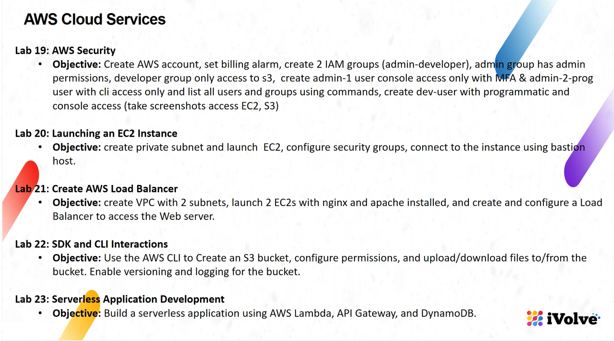

# AWS Cloud Service Labs 



## Solution of AWS labs 

## Lab List

| Lab Number | Lab Title                                                                                                      | Link                                                                                   |
|------------|-----------------------------------------------------------------------------------------------------------------------------------|-------------------------------------------------------------------------------------------------------------------------------------------------|
| Lab 19     |  AWS Security                                     | [Lab 19](https://github.com/Osamaomera/IVOLVE-OJT/tree/main/AWS/lab-19)       |
| Lab 20     |  Launching an EC2 Instance                        | [Lab 20](https://github.com/Osamaomera/IVOLVE-OJT/tree/main/AWS/lab-20)       |
| Lab 21     |  Create AWS Load Balancer                         | [Lab 21](https://github.com/Osamaomera/IVOLVE-OJT/tree/main/AWS/lab-21)       |
| Lab 22     |  SDK and CLI Interactions                         | [Lab 22](https://github.com/Osamaomera/IVOLVE-OJT/tree/main/AWS/lab-22)       |
| Lab 23     |  Serverless Application Development               | [Lab 23](https://github.com/Osamaomera/IVOLVE-OJT/tree/main/AWS/lab-23)       |


## Folder Structure
```
AWS/
│
├── Lab 19/
│   ├── README.md
│   └── screenshots/
│       
│       
├── Lab 20/
│   ├── README.md
│   └── screenshots/
│       
│       
├── Lab 21/
│   ├── README.md
│   └── screenshots/
│       
│       
├── Lab 22/
│   ├── README.md
│   └── screenshots/
│      
│       
├── Lab 23/
│   ├── README.md
│   └── screenshots/
│      
└── README.md
```