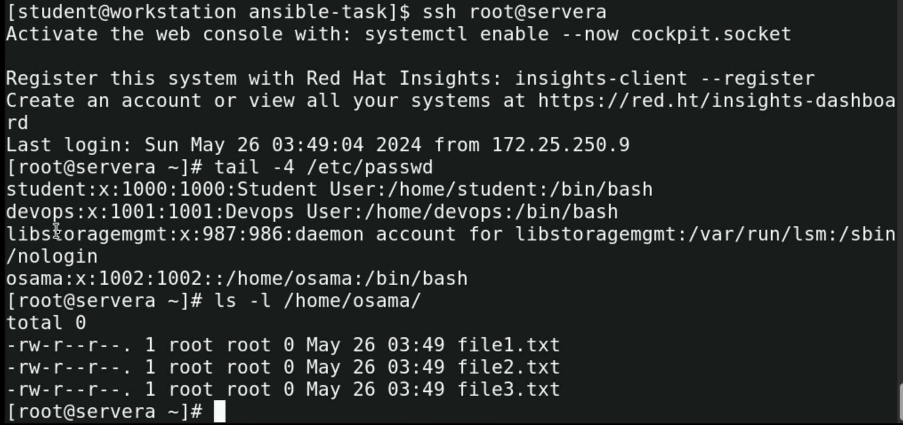
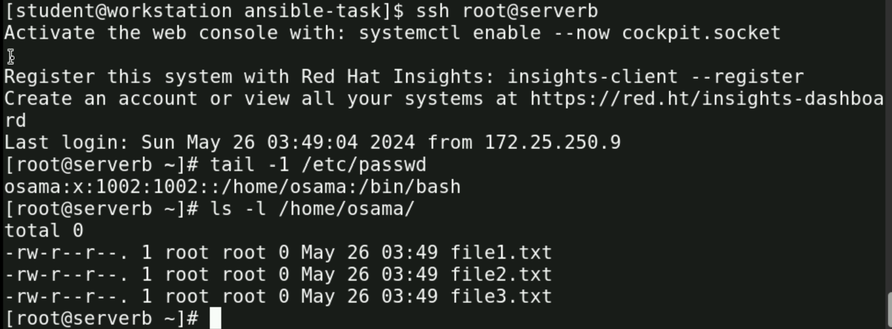
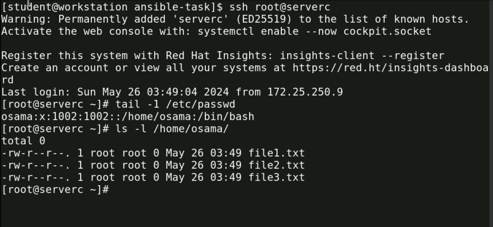

# Lab-1
## Run ansible ad-hoc command into 3 servers
install ansible and configure automation paltform on control nodes, create inventory of 3 managed hosts and then perform ad-hoc commands to check functionallity.

### Usage
1. install ansible automation platform.
    ```
    sudo apt install ansible #for ubuntu
    sudo dnf install ansible #for redhat
    ```
2. clone the repository or download the `inventory` file to your local machine.

3. add 3 hosts to your invntory file:
    ```
    servera.lab.example.com
    serverb.lab.example.com
    serverc.lab.example.com
    ```
3. create inventory and ansible.cfg to using defulats

show the inventory
  ```
  servera.lab.example.com
  serverb.lab.example.com
  erverc.lab.example.com
  ```

4. Run the ad-hoc command in ansible to 3 hosts 
    ```sh
    ansible all -i inventory -b -m shell -a 
    "useradd osama && touch /home/osama/file{1..3}.txt"
    ```
#  Output 
## Server A
### the user osama is created and also 3 files is created (file1,file2,file3).txt
  

# Server B
### the user osama is created and also 3 files is created (file1,file2,file3).txt
  
    
# Server C
### the user osama is created and also 3 files is created (file1,file2,file3).txt
  