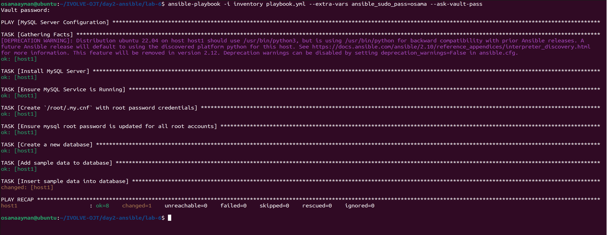
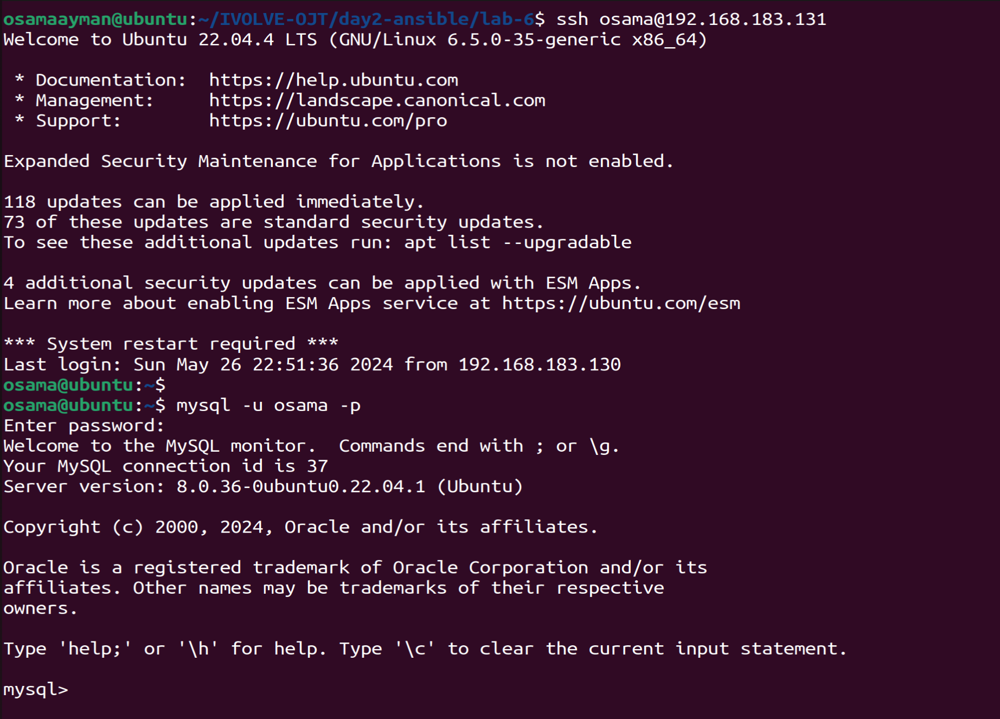
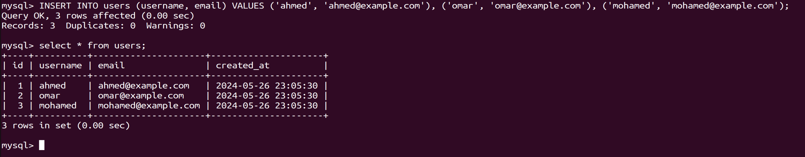

# Lab-3
## Ansible Playbook to Install mysql database and create a user to query database
This repository contains an Ansible playbook designed to install mysql database on target host and create a mysql users and verification of database functionality using the created user.

## Prerequisites
1. Ansible: Ensure Ansible is installed on your control node.
2. SSH Access: Ensure SSH access to the target node(s) where MySQL will be installed.
3. Inventory File: Prepare an inventory file containing the IP addresses or hostnames of the target server(s).
4. Vault File: Create a vault file (vault.yml) to securely store sensitive information such as passwords.
***


### Installation steps
1. install ansible automation platform.
    ```
    sudo apt install ansible #for ubuntu
    sudo dnf install ansible #for redhat
    ```
2. clone the repository or download the `lab-5` folder to your local machine.
    ```sh
    git clone https://github.com/Osamaomera/IVOLVE-OJT.git
    ```
3. look at my inventory file:
     ```
        [my_hosts]
        host1 ansible_host=192.168.183.131 ansible_user=osama
        [all:vars]  
        ansible_ssh_private_key_file=~/.ssh/id_rsa_ansible
    ```
4. add a secret file that contain the mysql credentials 
    ```sh
    mysql_root_password: "root"
    mysql_username: "osama"
    mysql_password: "osama"
    mysql_database: "ivolve-test"
    ansible_host: "192.168.183.131"
    sudo_password: "osama"
    ```
5. run ansible-vault to encrypt this secret file  
    ```sh
    ansible-vault encrypt ./vars/mysql_credentials.yml
    ```
6. create a dump.sql a simple table to put into the ivolve-test database
    ```
    CREATE TABLE IF NOT EXISTS test (message varchar(255) NOT NULL) 
    ENGINE=MyISAM DEFAULT CHARSET=utf8;         
    INSERT INTO test(message) VALUES('Ansible To Do List');
    INSERT INTO test(message) VALUES('Get ready');         
    INSERT INTO test(message) VALUES('Ansible is fun')
    ```
7. Finally run the ansible playbook.yml
    ```sh
    ansible-playbook -i inventory playbook.yml --extra-vars ansible_sudo_pass=osama --ask-vault-pass
    ```

### Successfully run of ansible playbook  


### ssh to connect to host which run mysql and show the login to mysql by osama who created by ansible playbook. 



### Run some queries to show the data in ivolve-test database  


### Create a users table and Insert a example data

 
