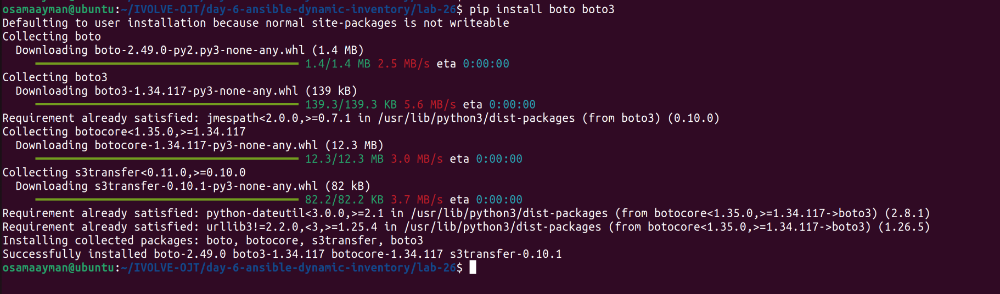
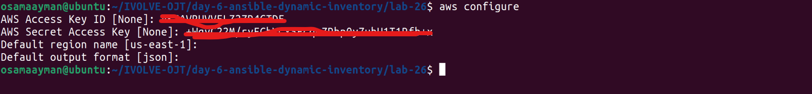
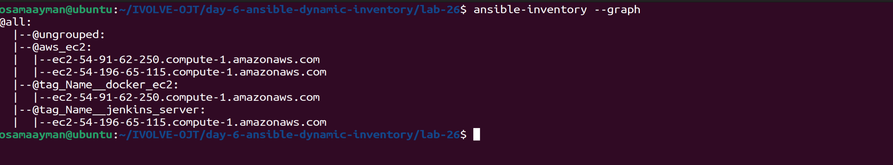
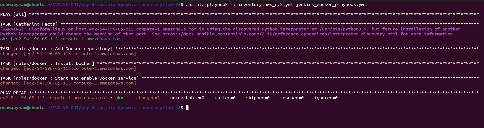
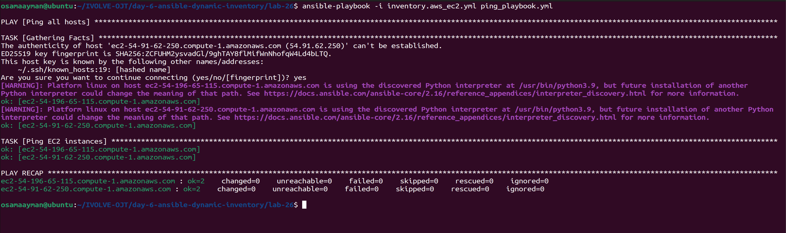

# Ansible Dynamic Inventory and Roles

## Overview

This project demonstrates how to use Ansible for dynamic inventory management and role-based configuration. The structure includes roles for installing Docker, Jenkins, and OpenShift CLI (`oc`), and inventories for managing different environments.

## Project Structure

```
├───inventories
├───roles
│   ├───docker
│   │   ├───defaults
│   │   ├───handlers
│   │   ├───meta
│   │   ├───tasks
│   │   ├───tests
│   │   └───vars
│   ├───jenkins
│   │   ├───defaults
│   │   ├───handlers
│   │   ├───meta
│   │   ├───tasks
│   │   ├───tests
│   │   └───vars
│   └───oc
│       ├───defaults
│       ├───handlers
│       ├───meta
│       ├───tasks
│       ├───tests
│       └───vars
└───screenshots
```


## Requirements

- Ansible 2.9+
- SSH access to the target hosts
- AWS CLI configured with appropriate permissions
- `boto3` Python library installed

## Setup

1. **Clone the Repository**

   ```sh
   git clone https://github.com/Osamaomera/IVOLVE-OJT.git
   cd day-6-ansible-dynamic-inventory
   cd lab-26
   ```

2. **Configure AWS CLI**

   Ensure you have the AWS CLI configured with the necessary permissions to access your EC2 instances.

   ```sh
   aws configure
   ```

3. **Install Ansible EC2 Plugin Requirements**

   Ensure you have the `boto3` library installed.

   ```sh
   pip install boto3
   ```
   

4. **Setup Inventory**

   Define your inventory in the `lab-26` directory using the EC2 plugin.

   Example `inventory.aws_ec2.yml`:

   ```yaml
   plugin: aws_ec2
   regions:
     - us-east-1
   filters:
     instance-state-name: running
   strict: False
   host_key_checks: False
   ```

5. **Configure Ansible Roles**

   Each role should have its tasks defined in the `tasks` directory.


## Usage

To run the playbooks, use the following commands:

1. **Run Docker Playbook:**

   ```bash
   ansible-playbook -i inventory.aws_ec2.yml docker_playbook.yml
   ```
2. **Run Jenkins Playbook:**

    ```bash
    ansible-playbook -i inventory.aws_ec2.yml jenkins_playbook.yml
    ```

3. **Run OpenShift CLI (oc) Playbook:**

   ```bash
   ansible-playbook -i inventory.aws_ec2.yml oc_playbook.yml
   ```

4. **Run Ping Playbook:**

   ```bash
   ansible-playbook -i inventory.aws_ec2.yml ping_playbook.yml
   ```


## Dynamic Inventory Configuration

To use a dynamic inventory, you can use a script or a plugin. An example script might look like this:

`ec2.py`:

```python
#!/usr/bin/env python

import boto3
import json

ec2 = boto3.resource('ec2')

def get_instances():
    instances = ec2.instances.filter(
        Filters=[{'Name': 'jenkins-server', 'Values': ['running']}])
    inventory = {'all': {'hosts': []}}

    for instance in instances:
        inventory['all']['hosts'].append(instance.public_ip_address)

    return inventory

if __name__ == "__main__":
    print(json.dumps(get_instances()))
```

### Make the script executable:

```sh
chmod +x inventories/ec2.py
```

### Update your playbook command to use the dynamic inventory script:

```sh
ansible-playbook -i ec2.py ping.yml
```

### And an example plugin might look like this :

1. **Setup Inventory**

   Define your inventory in the `lab-26` directory using the EC2 plugin.

   Example `inventory.aws_ec2.yml`:

   ```yaml
   plugin: aws_ec2
   regions:
     - us-east-1
   filters:
     instance-state-name: running
   strict: False
   host_key_checks: False
   ```

2. **ansible config `ansible.cfg`**
    ```shell
    [defaults]
    remote_user = ec2-user
    inventory = inventory.aws_ec2.yml
    private_key_file = /home/osamaayman/ec2-ivolve.pem

    [inventory]
    enable_plugins = aws_ec2
    ```

## Acknowledgments

- [Ansible Documentation](https://docs.ansible.com/)
- [GitHub](https://github.com/)


## **Verify Installation**

   Check the `screenshots` directory for verification steps and screenshots to ensure that Docker, Jenkins, and OpenShift CLI are installed correctly.

## Screenshots
### AWS Configure



### Ensure that Ansible show the instances in AWS




### run the playbooks :

1. **Run Docker Playbook:**

   

2. **Run Ping Playbook:**

   

------------------------------------------------------------------------------