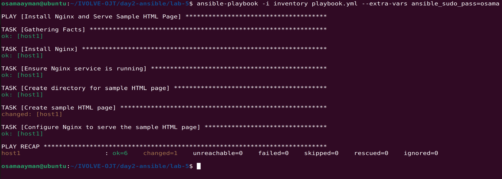
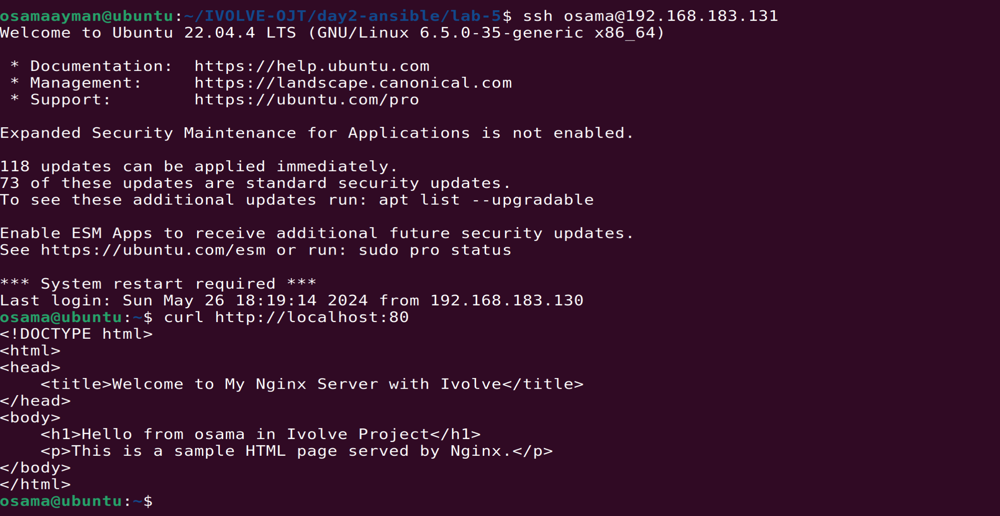
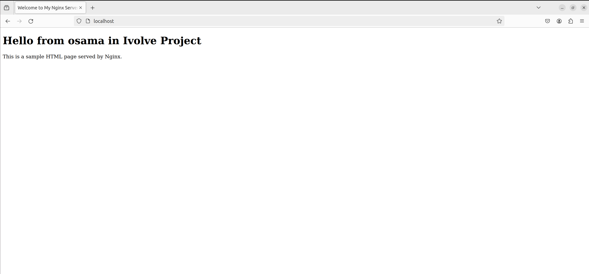

# Lab-5
## Ansible Playbook to Install NGINX and Deploy a Sample HTML File
This repository contains an Ansible playbook to install NGINX on target host and deploy a sample HTML file to the NGINX web directory.

## Requirements
Ansible installed on the control machine.
SSH access to the target server with sudo privileges.

### create inventory and ansible.cfg to using defulats

    show the inventory
    ```
    [my_hosts]
    host1 ansible_host=192.168.183.131 ansible_user=osama

    [all:vars]
    ansible_ssh_private_key_file=~/.ssh/id_rsa_ansible
    ```
    show the ansible.cfg
    ```
    [defaults]

    # Inventory file
    inventory = ./inventory

    # Remote user to use for SSH connections
    remote_user = osama

    # SSH private key file
    private_key_file = ~/.ssh/id_rsa_ansible
    ```

### Usage
1. install ansible automation platform.
```
sudo apt install ansible #for ubuntu
sudo dnf install ansible #for redhat
```
2. clone the repository or download the `lab-5` folder to your local machine.
```sh
git clone https://github.com/Osamaomera/IVOLVE-OJT.git
```
4. configure nginx server by nginx.conf.j2
```sh
server {
listen 80 default_server;
listen [::]:80 default_server;

root /var/www/html;
index index.html index.htm;

server_name _;

location / {
    try_files $uri $uri/ =404;
    }
}

```
5. run ansible playbook 
```sh
ansible-playbook -i inventory playbook.yml --extra-vars ansible_sudo_pass=osama
```
### Successfully run of ansible playbook  


### ssh to connect to host which run nginx and show the output of page by curl 



### The result Page when connect to nginx 

