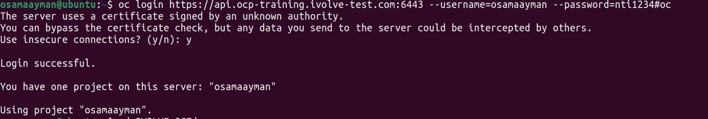
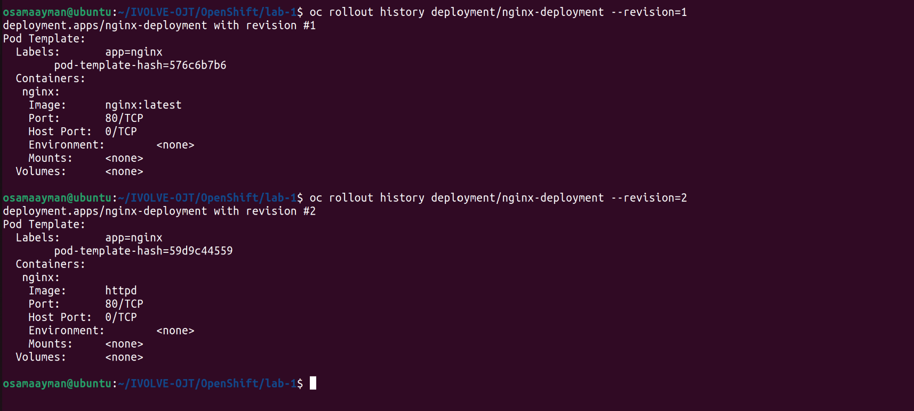

# Apache Deployment on OpenShift with Rollback to Nginx

This guide will walk you through the steps to deploy an Nginx application on OpenShift, expose it as a service, access it locally, update the deployment to Apache, observe the pod lifecycle, and rollback to the Nginx deployment.

## Prerequisites

- Access to an OpenShift cluster
- OpenShift CLI (`oc`) installed and configured

## Steps

### 1. Log in to Your OpenShift Cluster

```sh
oc login <your-cluster-url> --username=<your-username> --password=<your-password>
```



### 2. Create a New Project (Optional)

```sh
oc new-project my-web-project
```


### 3. Create the Nginx Deployment

```sh
oc apply -f deployment.yml
```


```sh
oc expose deployment deployment --port=80 --target-port=80
```


### 4. Verify the Service Details

```sh
oc get svc
```


### 6. Access the Service Locally

Forward a local port to the Nginx service:

```sh
oc port-forward svc/nginx-deployment 8080:80
```

Access the service locally via `http://localhost:8080` and take a screenshot of the Nginx welcome page.


### 7. Update the Deployment to Use Apache

```sh
oc set image deployment/nginx-deployment nginx=httpd
```

### 8. Watch the Status of the Pods

```sh
oc get pods -w
```


Access the service locally via `http://localhost:8080` and take a screenshot of the Nginx welcome page.


### 9. Show the Rollout History

```sh
oc rollout history deployment/nginx-deployment
```



### 10. Rollback to the Previous Nginx Deployment

```sh
oc rollout undo deployment/nginx-deployment to-revision=1
```


### 11. Watch the Status of the Pods During Rollback

```sh
oc get pods -w
```


### Complete Command Summary

Here is the complete list of commands for quick reference:

```sh
# Log in to the cluster
oc login <your-cluster-url> --username=<your-username> --password=<your-password>

# Create a new project (optional)
oc new-project my-web-project

# Create the Nginx deployment
oc apply -f deployment.yml 

# Expose the deployment as a service
oc expose deployment nginx-deployment --port=80 --target-port=80

# Get the service details
oc get svc

# Forward a local port to the Nginx pod
oc port-forward svc/nginx-deployment 8080:80

# Access the service locally via http://localhost:8080

# Update the deployment to use the Apache image
oc set image deployment/nginx-deployment nginx=httpd

# Watch the status of the pods to see termination and creation
oc get pods -w

# Show the rollout history
oc rollout history deployment/nginx-deployment

# Rollback to the previous version (Nginx)
oc rollout undo deployment/nginx-deployment to-revision=1

# Watch the status of the pods to see the rollback
oc get pods -w
```