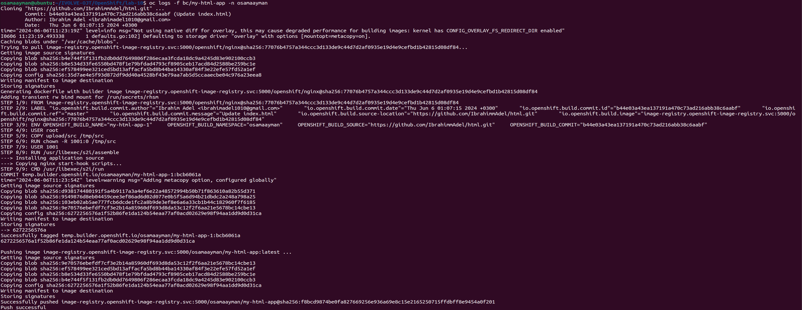
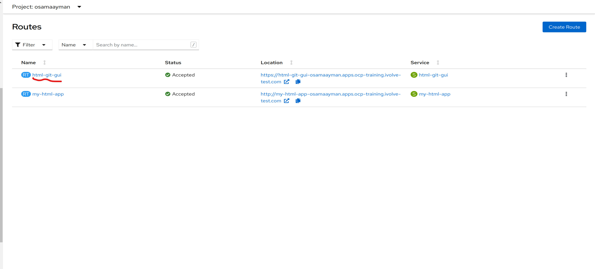

# Lab 10: Source-to-Image (S2I) Workflow

## Objective
The objective of this lab is to use Source-to-Image (S2I) to build container images directly from application source code and deploy an application using the S2I workflow.


## Explanation of Build and BuildConfig

| Aspect               | Description                                                                                                                                                                  | Example                                                                                       |
|----------------------|------------------------------------------------------------------------------------------------------------------------------------------------------------------------------|-----------------------------------------------------------------------------------------------|
| Build                | A process of transforming source code into a runnable image.                                                                                                                 | -                                                                                                                                                           |
| BuildConfig          | Defines how to build and package an application. Includes specifications for source code repository, build strategy, output image destination, triggers, environment variables, etc. | -                                                                                                                                                           |
| Source-to-Image (S2I) | A build strategy that uses pre-built builder images to create application images directly from source code without needing a Dockerfile.                                    | `oc new-build <builder-image>~<source-code> --name=<app-name>`                                                                                            |
| SourceStrategy       | A build strategy that copies the source code into the builder image and runs build scripts within the image to create the final application image.                           | ```yaml apiVersion: build.openshift.io/v1 kind: BuildConfig metadata:   name: my-build-config spec:   source:     type: Git     git:       uri: "https://github.com/myrepo.git"   strategy:     type: Source     sourceStrategy: {}``` |
| DockerStrategy       | A build strategy that uses a Dockerfile to build the application image.                                                                                                      | ```yaml apiVersion: build.openshift.io/v1 kind: BuildConfig metadata:   name: my-build-config spec:   source:     type: Git     git:       uri: "https://github.com/myrepo.git"   strategy:     type: Docker     dockerStrategy: {}``` |
| Pipeline             | A build strategy that defines a series of build steps, including source code checkout, build, test, and deployment, orchestrated using Jenkins pipelines or Tekton pipelines. | `oc new-build --strategy=pipeline --name=<pipeline-name> --code=<pipeline-repo>`                                                                          |

---

Example of S2I Build using `oc new-build`:
```sh
oc new-build nginx~https://github.com/IbrahimmAdel/html.git --name=my-html-app
```


Example of SourceStrategy BuildConfig YAML:
```yaml
apiVersion: build.openshift.io/v1
kind: BuildConfig
metadata:
  name: my-build-config
spec:
  source:
    type: Git
    git:
      uri: "https://github.com/IbrahimmAdel/html.git"
  strategy:
    type: Source
    sourceStrategy: {}
```

Example of DockerStrategy BuildConfig YAML:
```yaml
apiVersion: build.openshift.io/v1
kind: BuildConfig
metadata:
  name: my-build-config
spec:
  source:
    type: Git
    git:
      uri: "https://github.com/IbrahimmAdel/html.git"
  strategy:
    type: Docker
    dockerStrategy: {}
```

Example of Pipeline Build using `oc new-build`:
```sh
oc new-build --strategy=pipeline --name=my-pipeline --code=https://github.com/my-pipeline-repo.git
```

---

### Examples

#### Build Example
```sh
oc new-build nginx:latest~https://github.com/IbrahimmAdel/html.git --name=my-html-app
```

#### BuildConfig Example
```yaml
apiVersion: build.openshift.io/v1
kind: BuildConfig
metadata:
  name: my-html-app
  namespace: osamaayman
spec:
  source:
    type: Git
    git:
      uri: "https://github.com/IbrahimmAdel/html.git"
  strategy:
    sourceStrategy:
      from:
        kind: ImageStreamTag
        name: 'nginx:latest'
  output:
    to:
      kind: ImageStreamTag
      name: 'my-html-app:latest'
```

---

## Steps to Create and Build Application

### Method 1: Using `oc new-app` Command

1. **Create a New Build:**
   ```sh
   oc new-build nginx:latest~https://github.com/IbrahimmAdel/html.git --name=my-html-app -n osamaayman
   ```

   

2. **Start the Build Process:**
   ```sh
   oc start-build my-html-app -n osamaayman
   ```

3. **View Build Logs:**
   ```sh
   oc logs -f build/my-html-app-<build-id> -n osamaayman
   ```

4. **Expose the Service:**
   ```sh
   oc expose service/my-html-app -n osamaayman
   ```

   

5. **Access the Website:**
   Get the route URL using `oc get route` and access the website in your browser.

   

### Method 2: Using BuildConfig and DeploymentConfig YAML Files

1. **Create BuildConfig:**
   Create a file named `buildconfig.yaml` with the BuildConfig YAML content provided earlier. Apply the YAML file:
   ```sh
   oc apply -f buildconfig.yaml
   ```

2. **Start the Build Process:**
   ```sh
   oc start-build my-html-app -n osamaayman
   ```

3. **View Build Logs:**
   ```sh
   oc logs -f build/my-html-app-<build-id> -n osamaayman
   ```

   

4. **Create DeploymentConfig:**
   Create a file named `deploymentconfig.yaml` with the DeploymentConfig YAML content provided earlier. Apply the YAML file:
   ```sh
   oc apply -f deploymentconfig.yaml
   ```

5. **Expose the Service:**
   ```sh
   oc expose service/my-html-app -n osamaayman
   ```

6. **Access the Website:**
   Get the route URL using `oc get route` and access the website in your browser.

   

### Method 3: Using GUI (OpenShift Console)

1. **Import Git Repository:**
   - Login to the OpenShift console.
   - Go to the Developer perspective.
   - Click on "Import from Git" and provide the repository URL `https://github.com/IbrahimmAdel/html.git`.
   - Configure the build and deployment settings as required.
   - Start the build and monitor the progress.
   - Expose the service from the console.

   

   

   

   

   

   

   

   
-------------------