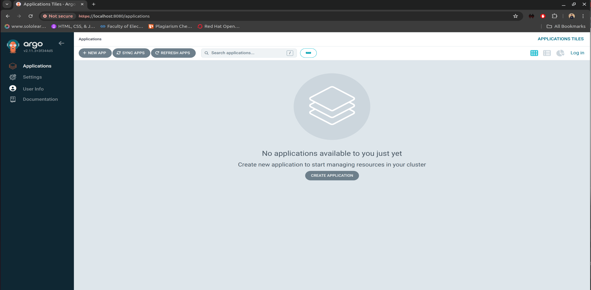

# Lab 11 Deploying and Managing Nginx Application with ArgoCD

## Objective
Deploy an Nginx application using `kubectl` and manage it using ArgoCD and ELK.

## Steps

### 1. Install ArgoCD in Your Kubernetes Cluster
Follow the official [ArgoCD installation guide](https://argo-cd.readthedocs.io/en/stable/getting_started/) to install ArgoCD in your cluster.

### 2. Install `argocd` CLI
```bash
curl -sSL -o /usr/local/bin/argocd https://github.com/argoproj/argo-cd/releases/download/v2.1.7/argocd-linux-amd64
chmod +x /usr/local/bin/argocd
```

### 3. Login to ArgoCD Server
Retrieve the initial admin password:
```bash
kubectl get secret argocd-initial-admin-secret -n argocd -o jsonpath="{.data.password}" | base64 -d
```

Login to ArgoCD:
```bash
argocd login <ARGOCD_SERVER>
# Example:
argocd login --username admin --password <RETRIEVED_PASSWORD> <ARGOCD_SERVER>
```

### 4. Deploy Nginx Using `kubectl`
```bash
kubectl create deploy nginx --image=nginx -n default
kubectl expose deploy nginx --port=80 --type=NodePort -n default
```

### 5. Create a Secret for Git Repository Credentials
Replace `<your-username>` and `<your-password>` with your actual Git repository username and password:
```bash
kubectl create secret generic argocd-repo-creds \
  --from-literal=username=<your-username> \
  --from-literal=password=<your-password> \
  -n argocd
```

### 6. Update the ArgoCD Repository Configuration
Save the following YAML as `repo-secret.yaml`:
```yaml
apiVersion: v1
kind: Secret
metadata:
  name: argocd-repo-creds
  namespace: argocd
  labels:
    argocd.argoproj.io/secret-type: repository
stringData:
  url: https://github.com/IbrahimmAdel/html.git
  username: <your-username>
  password: <your-password>
```

Apply the secret configuration:
```bash
kubectl apply -f repo-secret.yaml
```

### 7. Create ArgoCD Application
Save the following YAML as `nginx-app.yaml`:
```yaml
apiVersion: argoproj.io/v1alpha1
kind: Application
metadata:
  name: nginx-app
  namespace: argocd
spec:
  project: default
  source:
    repoURL: https://github.com/IbrahimmAdel/html.git
    path: .
    targetRevision: HEAD
  destination:
    server: https://kubernetes.default.svc
    namespace: default
  syncPolicy:
    automated:
      prune: true
      selfHeal: true
```

Apply the application configuration:
```bash
kubectl apply -f nginx-app.yaml
```

### 8. Sync the ArgoCD Application
```bash
argocd app sync nginx-app
```

### 9. Port Forward to Access ArgoCD UI
```bash
kubectl port-forward svc/argocd-server -n argocd 8080:443
```

### 10. Access ArgoCD UI
Open a web browser and go to `https://localhost:8080`. Login with the admin user and the password you retrieved earlier.

### 11. Monitor and Manage the Application
In the ArgoCD UI, you should see the `nginx-app` listed. You can now monitor and manage the Nginx application through ArgoCD.

## Screenshots 





## Deploying ELK Using Operators

1. **Install the Elastic Cloud on Kubernetes (ECK) Operator**:
   Ensure you have installed the ECK Operator in your Kubernetes cluster. You can follow the installation steps from the [official ECK documentation](https://www.elastic.co/guide/en/cloud-on-k8s/current/k8s-deploy-eck.html).

2. **Create an Elasticsearch Cluster**:
   Save the following YAML as `elasticsearch.yaml`:
   ```yaml
   apiVersion: elasticsearch.k8s.elastic.co/v1
   kind: Elasticsearch
   metadata:
     name: quickstart
     namespace: elastic-system
   spec:
     version: 7.10.0
     nodeSets:
     - name: default
       count: 1
       config:
         node.store.allow_mmap: false
   ```

   Apply the configuration:
   
   ```bash
    kubectl apply -f elasticsearch.yaml
   ```

3. **Create a Kibana Instance**:
   Save the following YAML as `kibana.yaml`:
   ```yaml
   apiVersion: kibana.k8s.elastic.co/v1
   kind: Kibana
   metadata:
     name: quickstart
     namespace: elastic-system
   spec:
     version: 7.10.0
     count: 1
     elasticsearchRef:
       name: quickstart
   ```

   Apply the configuration:
   ```bash
   kubectl apply -f kibana.yaml
   ```

4. **Port Forward to Access Kibana**:
   ```bash
   kubectl port-forward svc/quickstart-kb-http 5601 -n elastic-system
   ```

5. **Access Kibana UI**:
   Open a web browser and go to `http://localhost:5601`. You can now access the Kibana UI and monitor your Elasticsearch cluster.

## Screenshots


