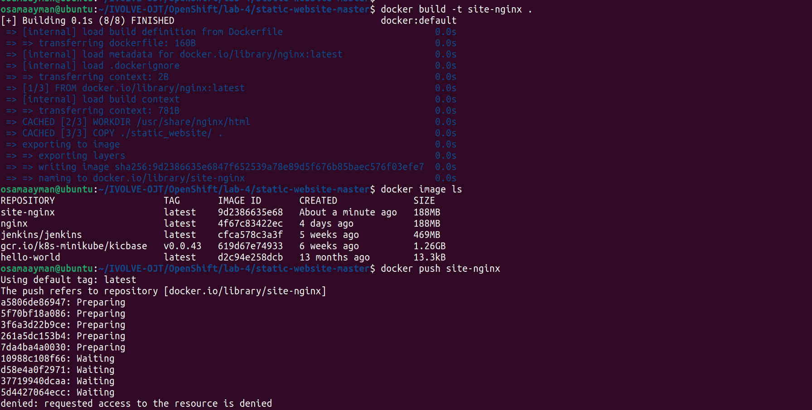
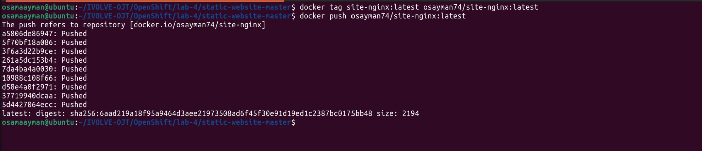
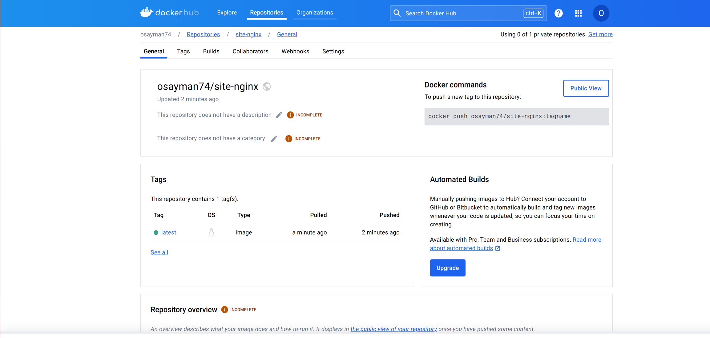
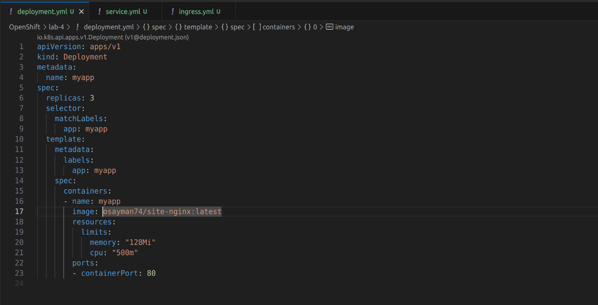
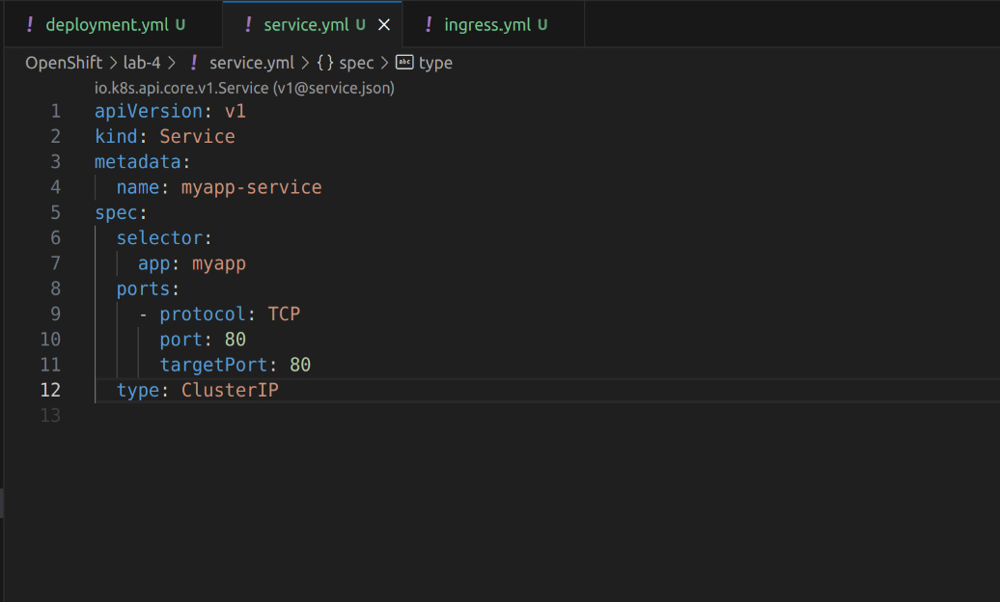
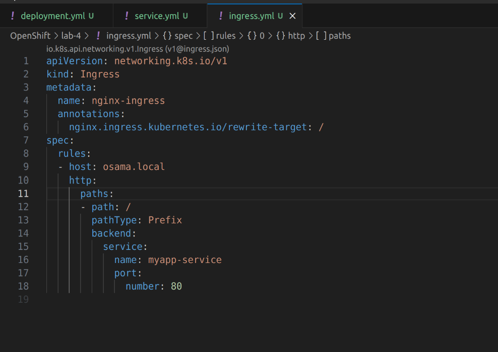
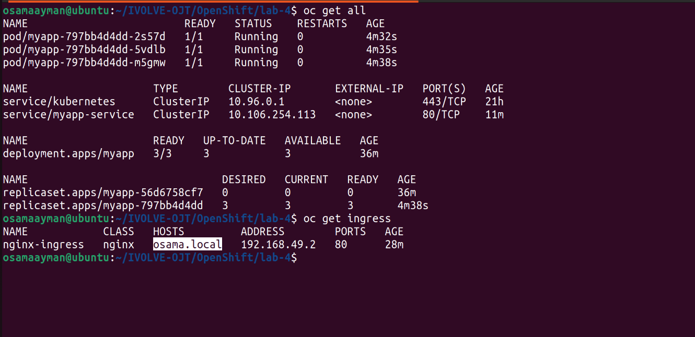
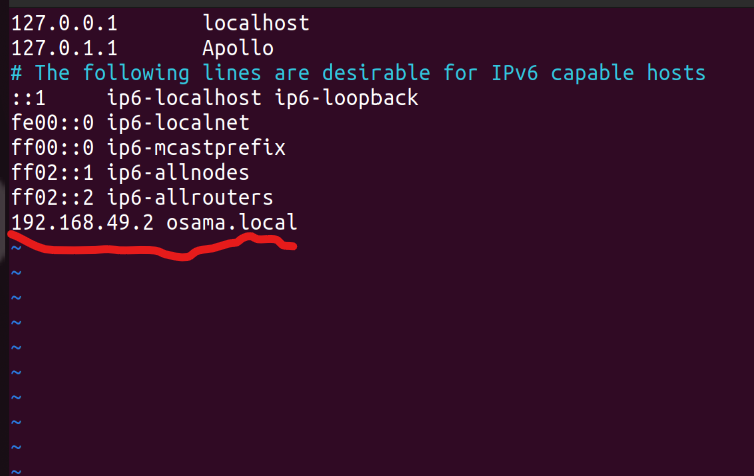
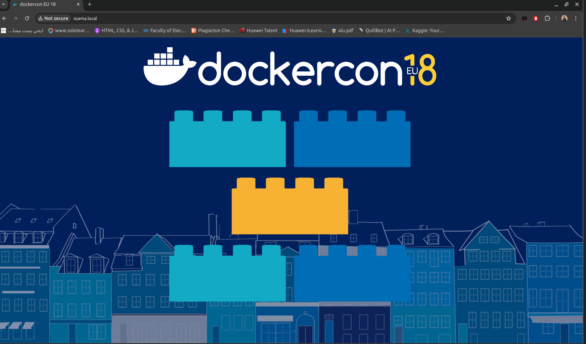

# Lab 4: Network Configuration

## Objective

Build a custom NGINX image from a Dockerfile, push it to DockerHub, create a deployment using this image, create a service to expose the deployment, define a network policy, enable NGINX Ingress controller using Minikube addons, create an Ingress resource, update /etc/hosts to map the domain to the Minikube IP address, and access the custom NGINX service via the Ingress endpoint using the domain name. Also, create a route in OpenShift.

## Prerequisites

1. Minikube installed and running.
2. Docker installed on your local machine.
3. An OpenShift cluster set up and logged in (`oc login`).
4. Git installed on your local machine.

## Steps

1. **Build Custom NGINX Image and Push to DockerHub**

   Clone the repository and navigate to the Dockerfile directory:
   ```sh
   git clone https://github.com/IbrahimmAdel/static-website.git
   cd static-website
   ```

   Build the Docker image:
   ```sh
   docker build -t your-dockerhub-username/nginx-custom .
   ```

    

   Log in to DockerHub:
   ```sh
   docker login
   ```

   Push the image to DockerHub:
   ```sh
   docker push your-dockerhub-username/nginx-custom
   ```
    


    

2. **Create Deployment and Service in Minikube**

    

   Create a deployment using the custom NGINX image:
   ```sh
   oc apply -f deployment.yml
   ```

    

   Expose the deployment as a service:
   ```sh
   oc apply -f service.yml
   ```

3. **Define Network Policy**

   Create a network policy to allow traffic only from pods within the same namespace to NGINX pods:
   ```yaml
   # network-policy.yaml
   apiVersion: networking.k8s.io/v1
   kind: NetworkPolicy
   metadata:
     name: nginx-network-policy
   spec:
     podSelector:
       matchLabels:
         app: nginx-custom
     policyTypes:
     - Ingress
     ingress:
     - from:
       - podSelector:
           matchLabels:
             app: nginx-custom
   ```

   Apply the network policy:
   ```sh
   oc apply -f network-policy.yaml
   ```

4. **Enable NGINX Ingress Controller in Minikube**

   Enable the NGINX Ingress controller addon:
   ```sh
   minikube addons enable ingress
   ```

5. **Create Ingress Resource**

   Create an Ingress resource to route traffic to the NGINX service:
   ```yaml
   # ingress.yaml
   apiVersion: networking.k8s.io/v1
   kind: Ingress
   metadata:
     name: nginx-ingress
   spec:
     rules:
     - host: your-domain.com
       http:
         paths:
         - path: /
           pathType: Prefix
           backend:
             service:
               name: nginx-custom
               port:
                 number: 80
   ```

   Apply the Ingress resource:
   ```sh
   oc apply -f ingress.yaml
   ```
    

    

6. **Update /etc/hosts**

   Edit your `/etc/hosts` file and add an entry to map your-domain.com to Minikube IP:
   ```
   <Minikube-IP> your-domain.com
   ```

    

7. **Access Custom NGINX Service via Ingress Endpoint**

   Open your web browser and navigate to `http://your-domain.com`. You should see the custom NGINX website.

   

<!-- 8. **Create Route in OpenShift**

   Create a route in OpenShift to expose the NGINX service externally:
   ```sh
   oc expose svc/nginx-custom
   ``` -->
