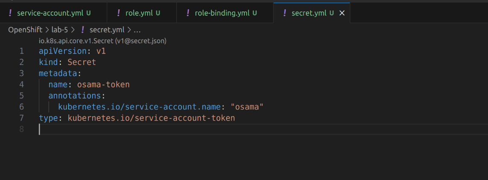

# Lab 5: OpenShift Security and RBAC

## Objective

The objective of this lab is to demonstrate the concepts of OpenShift security and Role-Based Access Control (RBAC) by performing the following tasks:

1. Create a ServiceAccount.
2. Define a Role named pod-reader allowing read-only access to pods in the namespace.
3. Bind the pod-reader Role to the ServiceAccount.
4. Get the ServiceAccount token.
5. Make a comparison between role & role binding and cluster role & cluster role binding.

## Steps

### 1. Create ServiceAccount

Create a ServiceAccount named `osama` using the following YAML file:


```sh
oc apply -f service-account.yml
```

### 2. Define Role

Define a Role named `pod-reader` that allows read-only access to pods in the namespace using the following YAML definition:

```yaml
# pod-reader-role.yaml
apiVersion: rbac.authorization.k8s.io/v1
kind: Role
metadata:
  namespace: default
  name: pod-reader
rules:
- apiGroups: [""]
  resources: ["pods"]
  verbs: ["get", "list", "watch"]
```


Apply the Role:
```sh
oc apply -f role.yml
```

### 3. Bind Role to ServiceAccount

Bind the `pod-reader` Role to the `osama` ServiceAccount using a RoleBinding:

```yaml
# rolebinding.yaml
apiVersion: rbac.authorization.k8s.io/v1
kind: RoleBinding
metadata:
  name: pod-reader-binding
  namespace: default
subjects:
- kind: ServiceAccount
  name: osama
  namespace: default
roleRef:
  kind: Role
  name: pod-reader
  apiGroup: rbac.authorization.k8s.io
```


Apply the RoleBinding:
```sh
oc apply -f rolebinding.yml
```

### 4. Get ServiceAccount Token

Create a ServiceAccount token for `osama` :
```yaml
# secret.yml
apiVersion: v1
kind: Secret
metadata:
  name: osama-token
  annotations:
    kubernetes.io/service-account.name: "osama"
type: kubernetes.io/service-account-token
```


### OUTPUTS:


### 5. Comparison

#### Role & RoleBinding

- **Role:** Defines a set of permissions within a namespace.
- **RoleBinding:** Binds a Role to a User, Group, or ServiceAccount within the same namespace.

#### ClusterRole & ClusterRoleBinding

- **ClusterRole:** Defines a set of permissions across all namespaces in the cluster.
- **ClusterRoleBinding:** Binds a ClusterRole to a User, Group, or ServiceAccount across the entire cluster.

## Conclusion

By completing these steps, you have demonstrated the use of ServiceAccounts, Roles, and RoleBindings in OpenShift to manage access control and security within your cluster.

For more information, refer to the official OpenShift documentation on RBAC: [RBAC in OpenShift](https://docs.openshift.com/container-platform/4.8/authentication/using-rbac.html).
