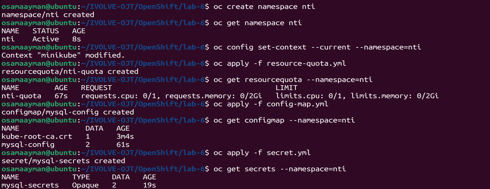
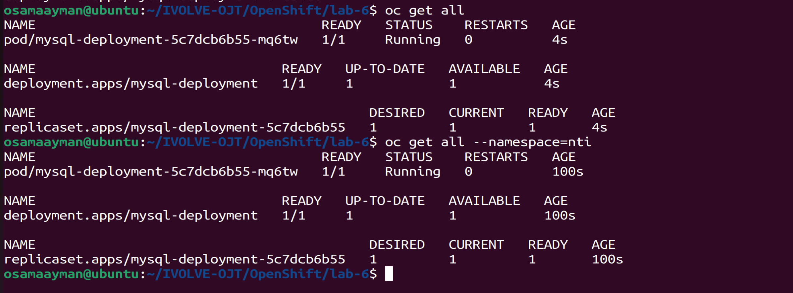
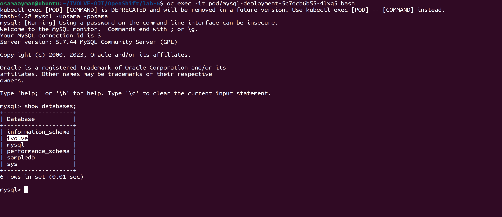

# Lab 6: Configuring a MySQL Pod using ConfigMap and Secret

## Objective

The objective of this lab is to configure a MySQL pod in a namespace called `nti` using ConfigMap and Secret. This includes defining the MySQL database name and user in a ConfigMap, storing the MySQL root password and user password in a Secret, and setting resource requests and limits for the pod.

## Steps

### 1. Create Namespace and Resource Quota

Create a namespace called `nti` and apply resource quota to limit resource usage within the namespace.

```sh
# Create namespace
oc create namespace nti

# Apply resource quota
oc apply -f resource-quota.yml
```

The `resource-quota.yml` file should contain the resource quota specifications for CPU and memory limits.

### 2. Create ConfigMap and Secret

Define MySQL database name and user in a ConfigMap, and store MySQL root password and user password in a Secret.

```sh
# Create ConfigMap
oc apply -f config-map.yml -n nti

# Create Secret
oc apply -f secret.yml -n nti
```

Replace `your-root-password` and `your-user-password` with actual passwords.



### 3. Create Deployment for MySQL Pod

Create a Deployment in the `nti` namespace for the MySQL pod that uses the ConfigMap and Secret, and set resource requests and limits.

```sh
# Create Deployment
oc apply -f mysql-deployment.yaml -n nti
```

The `mysql-deployment.yaml` file should contain the Deployment specifications, including the ConfigMap and Secret references, and resource requests and limits for CPU and memory.




### 4. Verify MySQL Configuration

Exec into the MySQL pod and verify the MySQL configuration.

```sh
# Exec into MySQL pod
oc exec -it <mysql-pod-name> -n nti -- /bin/bash

# Verify MySQL configuration
mysql -u osama -p osama
```



## Conclusion

By following these steps, you have successfully configured a MySQL pod using ConfigMap and Secret in the `nti` namespace, applied resource quotas, and verified the MySQL configuration.

For more information, refer to the official Kubernetes documentation on ConfigMap and Secret: [ConfigMaps](https://kubernetes.io/docs/concepts/configuration/configmap/) and [Secrets](https://kubernetes.io/docs/concepts/configuration/secret/).
