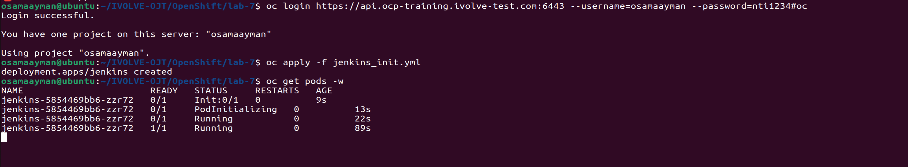
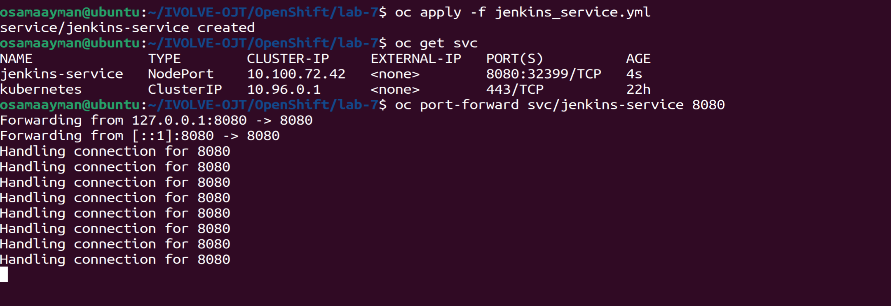
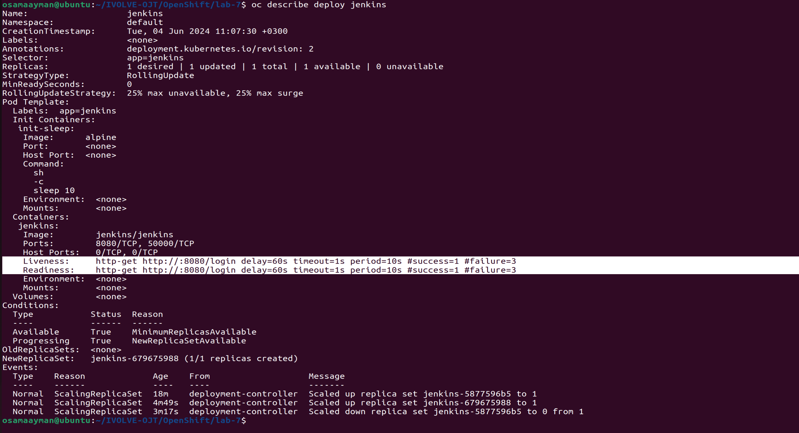
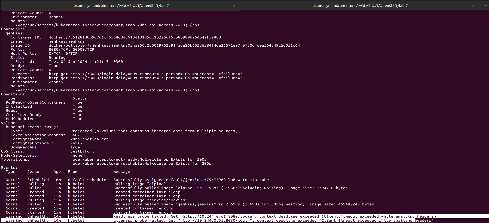
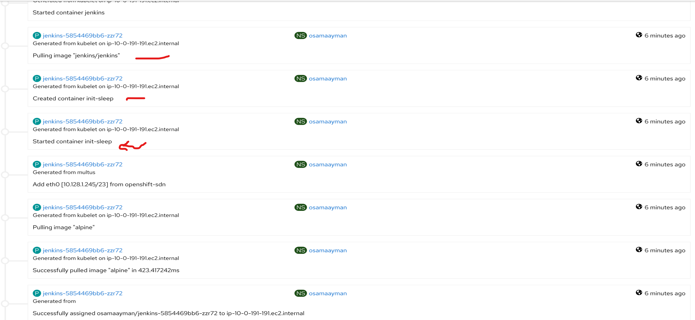
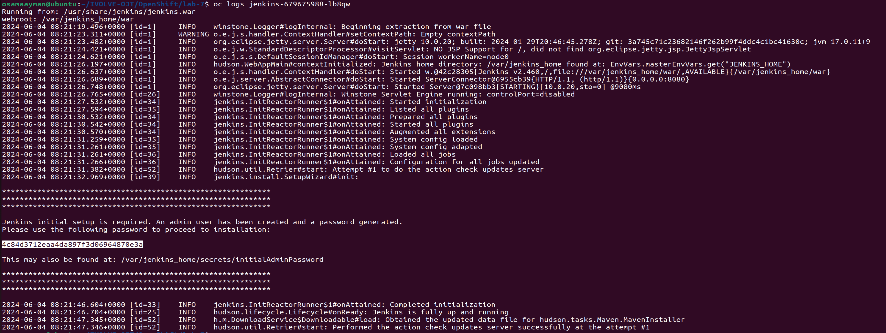
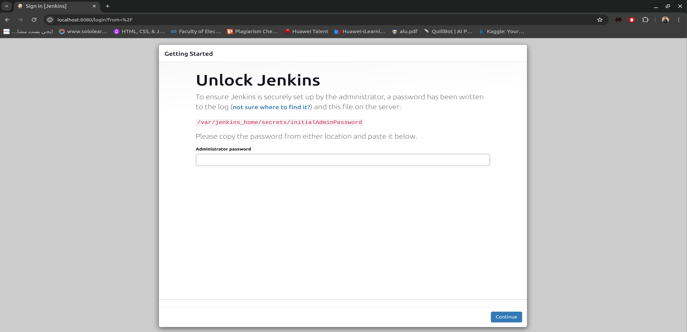

# Multi-container Application Deployment with Jenkins

## Objective
The objective of this project is to create a Kubernetes deployment for Jenkins with an initContainer that sleeps for 10 seconds before the Jenkins container starts. Additionally, readiness and liveness probes will be implemented to monitor Jenkins. A NodePort service will be created to expose Jenkins, and we will verify that the initContainer runs successfully and Jenkins is properly initialized.

## Components

### InitContainer
An initContainer is a separate container that runs before the main application container starts. In this project, the initContainer will sleep for 10 seconds before allowing the Jenkins container to start. This delay ensures that any necessary setup or initialization tasks are completed before Jenkins starts.

### Readiness and Liveness Probes
Readiness and liveness probes are mechanisms used by Kubernetes to determine the health of a container. 
- **Readiness Probe**: This probe is used to determine when a container is ready to start accepting traffic. We will configure a readiness probe to ensure that Jenkins is fully initialized and ready to handle requests before it starts receiving traffic.
- **Liveness Probe**: This probe is used to determine if a container is still running as expected. We will configure a liveness probe to periodically check if Jenkins is responsive and restart the container if it becomes unresponsive.

### NodePort Service
A NodePort service is a Kubernetes service that exposes an application to the outside world by mapping a port on each Kubernetes node to a port on the service. We will create a NodePort service to expose Jenkins externally, allowing users to access it from their web browsers.

## Deployment Steps
1. Clone this repository to your local machine.
    ```shell
    git clone https://github.com/Osamaomera/IVOLVE-OJT.git
    ```
2. Navigate to the directory containing the Kubernetes configuration files.
    ```bash
    cd OpenShift
    cd lab-7
    ```
3. Apply the deployment YAML file using the `oc apply -f jenkins_init.yml` command.
    ```shell
    oc apply -f jenkins_init.yml
    ```
    

4. Apply the service YAML file using the `oc apply -f jenkins_service.yml` command.
    ```shell
    oc apply -f jenkins_service.yml
    ```
    

5. Monitor the deployment and service using `oc get pods`, `oc get deployments`, and `oc get services`.

6. Once the deployment is complete, access Jenkins using the NodePort service URL.
    
    
    

    

## Jenkins Start






## Additional Notes
- Ensure that you have a Kubernetes cluster set up and configured before deploying Jenkins.
- Make sure to configure appropriate resource limits and requests for Jenkins containers based on your deployment environment and requirements.

## Author
Osama Ayman
