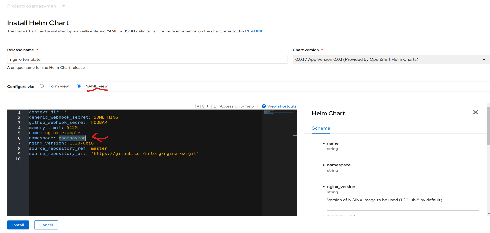

# Lab 8: Helm Chart Deployment

## Objective
The objective of this lab is to use Helm Chart to deploy and manage applications in an OpenShift cluster. We will explore Helm charts for common services, create a new Helm chart for Nginx, deploy the Helm chart, verify the deployment, access the Nginx server, and delete the Nginx release.

## Steps
1. **Understanding Helm and Helm Charts:**
   - Helm is a package manager for Kubernetes that simplifies the deployment and management of applications using Helm Charts.

2. **Exploring Helm Charts for Common Services:**
   - Explore existing Helm Charts for common services in the Helm repository to understand their structure and configurations.

3. **Creating a New Helm Chart for Nginx:**
   - Use the Helm CLI to generate a new Helm Chart for deploying Nginx.
   - Customize the `values.yaml`, `templates/deployment.yaml`, and `templates/service.yaml` files in the new Helm Chart directory (`nginx`) as per your Nginx deployment requirements.

4. **Deploying the Helm Chart and Verifying Deployment:**
   - Install the Helm Chart for Nginx in your OpenShift cluster using Helm CLI.
     ```
     helm install nginx ./nginx-chart
     ```
   - Verify the successful deployment using:
     ```
     oc get pods
     ```
    
    

5. **Accessing the Nginx Server:**
   - Get the Nginx service URL using:
     ```
     oc get svc
     ```
   - Access the Nginx server through the provided URL in a web browser or using a command-line tool.

    

6. **Deleting the Nginx Release:**
   - Delete the deployed Nginx release from your OpenShift cluster using Helm CLI:
     ```
     helm uninstall mynginx
     ```

7. **Installing Nginx Helm in OpenShift Console GUI:**
   - Log in to your OpenShift console and navigate to the Operators Hub or Helm Charts section.
   - Search for the Nginx Helm Chart and follow the on-screen instructions to configure and install it via the GUI.

    

    

    

    

    

    


## Additional Notes
- Make sure you have Helm and kubectl installed and configured to work with your OpenShift cluster before starting the lab.
- Customize the Helm Chart templates and values according to your specific application requirements.
- For more detailed information on Helm and Helm Charts, refer to the official Helm documentation.
