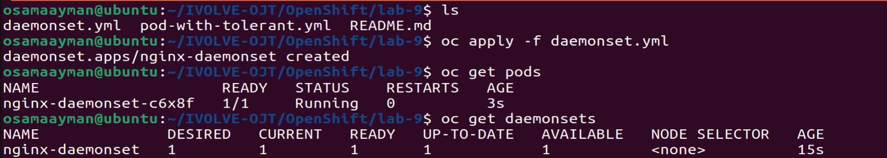
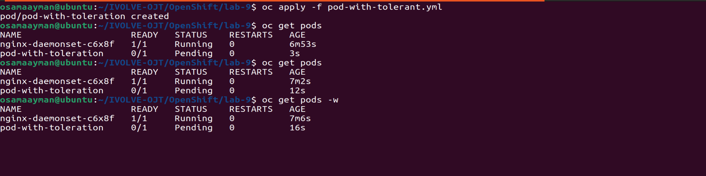
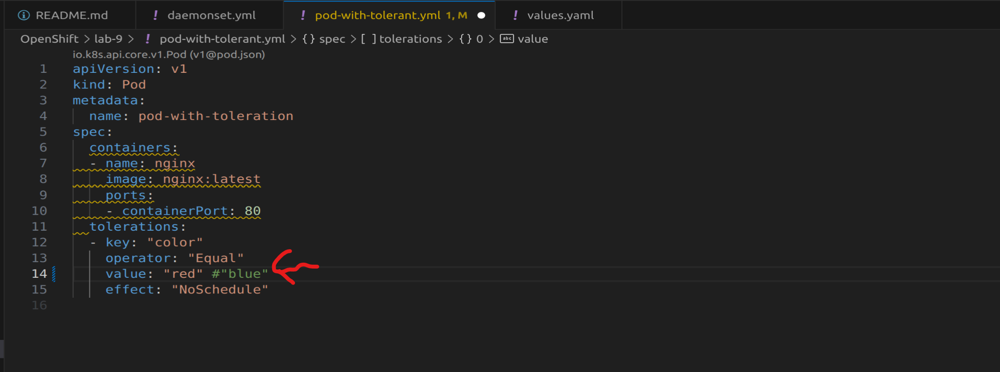
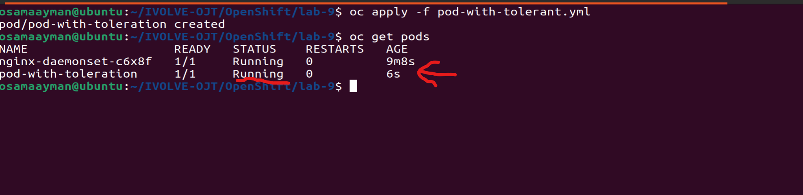

# lab-9: Daemonsets& Taint and Toleration

## Objective:
The objective of this lab is to understand DaemonSets and Taints/Tolerations in Kubernetes/OpenShift environments. We'll explore the concepts of DaemonSets and Taints/Tolerations, create a DaemonSet YAML file with an Nginx container, verify the number of pods created, and then simulate a tainted node using Minikube. We'll create pods with tolerations and observe their status. Finally, we'll compare Taints/Tolerations with Node Affinity.

## Components:

### DaemonSet:
A DaemonSet ensures that all (or some) nodes run a copy of a specific pod. It is used for deploying a single pod on all or specific nodes in the cluster. DaemonSets are commonly used for monitoring agents, logging daemons, and other types of background or infrastructure processes that should run on all or specific nodes.

### Taints and Tolerations:
Taints allow a node to repel a set of pods. Tolerations, on the other hand, enable pods to tolerate (or accept) the taints on nodes. This mechanism is used to control which pods can be scheduled on which nodes based on node conditions or characteristics.

### Node Affinity:
Node affinity is another way to influence pod scheduling decisions in Kubernetes. It allows you to constrain which nodes your pod is eligible to be scheduled on, based on labels on nodes.

## Deployment Steps:

### Step 1: Create a DaemonSet YAML File
Create a DaemonSet YAML file with a Pod template containing an Nginx container. Ensure that the `spec` section of the DaemonSet includes necessary configurations like labels, selector, and pod template.
    
```yaml
apiVersion: apps/v1
kind: DaemonSet
metadata:
  name: nginx-daemonset
  labels:
    app: nginx
spec:
  selector:
    matchLabels:
      app: nginx
  template:
    metadata:
      labels:
        app: nginx
    spec:
      containers:
      - name: nginx
        image: nginx:latest
        ports:
        - containerPort: 80
```

### Step 2: Apply the DaemonSet YAML
Apply the DaemonSet YAML file to your OpenShift cluster using the `kubectl apply -f daemonset.yaml` command.
```shell
kubectl apply -f daemonset.yml
```

### Step 3: Verify Number of Pods
Check the number of pods created by the DaemonSet using the `kubectl get pods` command. Ensure that there is one pod running on each node.
```bash
kubectl get pods
```


### Step 4: Taint the Minikube Node
Using Minikube, taint the node with a specific key-value pair `color=red` to simulate a tainted node. Use the `kubectl taint nodes <node_name> color=red:NoSchedule` command.
```bash
kubectl taint nodes minikube color=red:NoSchedule
```
### Step 5: Create a Pod with Toleration
Create a pod with toleration `color=blue` using a Pod YAML file. Apply the YAML file and observe the status of the pod. It should not be scheduled on the tainted node.

```yaml
apiVersion: v1
kind: Pod
metadata:
  name: pod-with-toleration
spec:
  containers:
  - name: nginx
    image: nginx:latest
    ports:
    - containerPort: 80
  tolerations:
  - key: "color"
    operator: "Equal"
    value: "blue"
    effect: "NoSchedule"
```



### Step 6: Change Toleration to 'color=red'
Modify the toleration of the pod to `color=red` and apply the changes. Observe what happens to the pod. It should now be scheduled on the tainted node.





## Comparison between Taints/Tolerations and Node Affinity

| Feature             | Taints/Tolerations                                     | Node Affinity                                             |
|---------------------|--------------------------------------------------------|------------------------------------------------------------|
| **Use Cases**       | - Ensure specific nodes don't receive certain pods     | - Define rules for pod placement based on node properties  |
|                     | - Assign pods to specific nodes based on tolerations   | - Direct pods to nodes with specific labels or attributes  |
|                     | - Handle node specialization (e.g., dedicated nodes)   | - Control pod placement for better resource utilization    |
| **Flexibility**     | - Fine-grained control over pod/node interactions      | - More specific targeting of nodes based on attributes     |
|                     | - Can tolerate multiple taints per pod                 | - Supports various node affinity types (required, preferred, etc.) |
|                     | - Taints can be applied to nodes dynamically           | - Affinity rules can be updated dynamically                |
| **Limitations**     | - Taints are applied at the node level                 | - Limited to node attributes and labels                     |
|                     | - Requires understanding of node taints and tolerations | - Affinity rules may become complex with many nodes and labels |
|                     | - Tolerations can lead to pod scheduling challenges     | - May limit flexibility in pod placement                    |

This table provides a quick overview of the differences between Taints/Tolerations and Node Affinity in terms of their use cases, flexibility, and limitations.