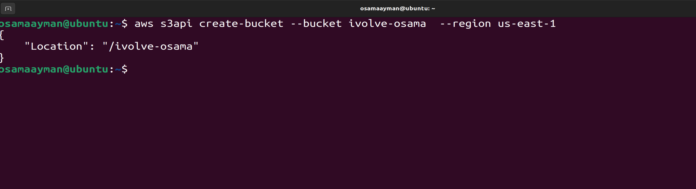
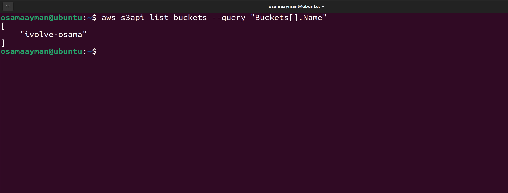
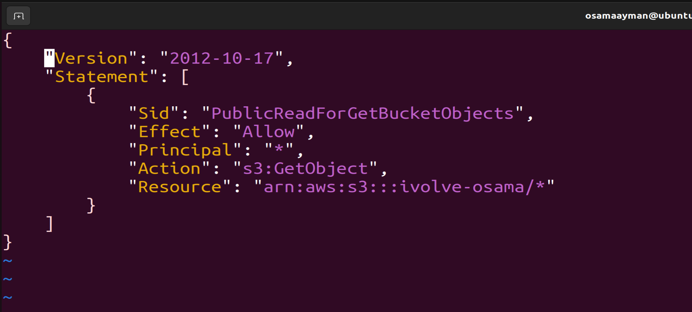
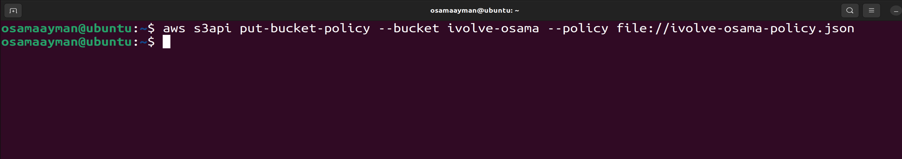
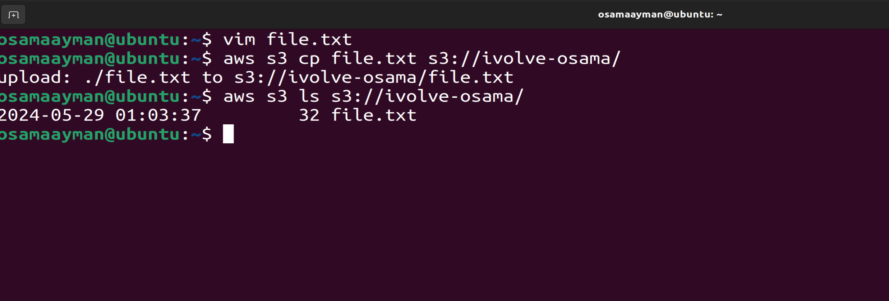
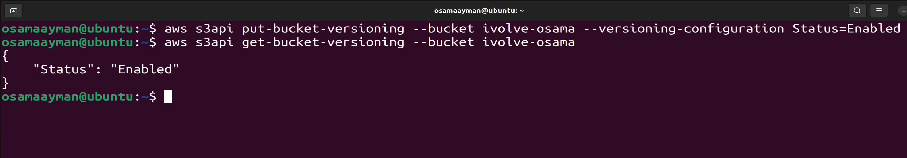
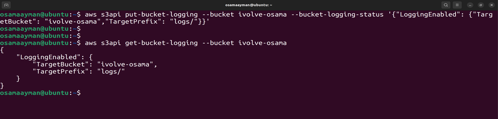
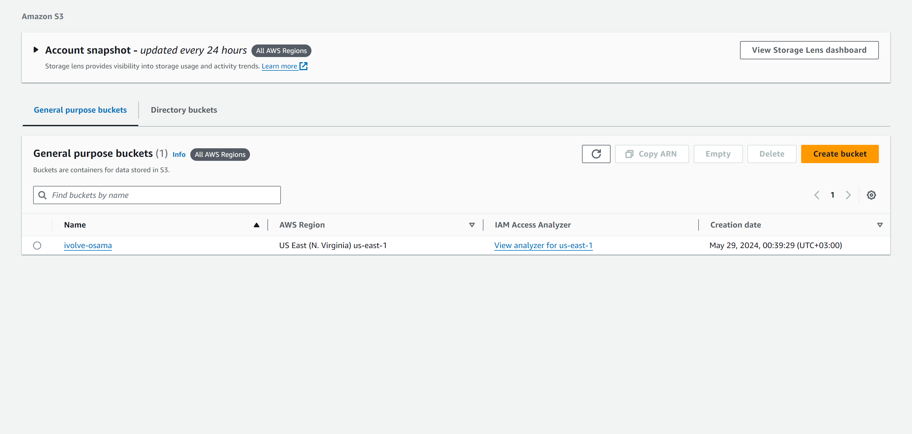
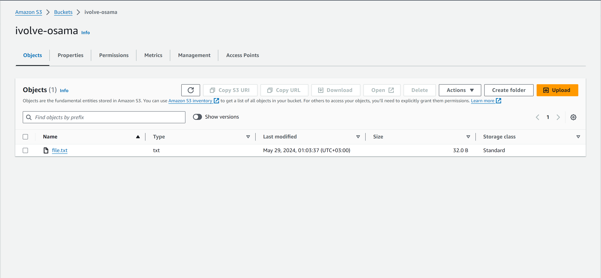

# Lab 22: SDK and CLI Interactions

## Objective
Use the AWS CLI to:
- Create an S3 bucket
- Configure permissions
- Upload and download files to/from the bucket
- Enable versioning and logging for the bucket

## Prerequisites
- AWS CLI installed and configured with your AWS account credentials.
- Basic knowledge of AWS S3 and IAM.

## Steps

## Step 1: Create an S3 Bucket
1. Open your terminal.

2. Use the following command to create an S3 bucket. 
- Bucket Name: `ivolve-osama` 
- region:  `us-east-1`.

    ```sh
    aws s3api create-bucket --bucket ivolve-osama --region us-east-1
    ```

3. Verify the bucket creation:

    ```sh
    aws s3api list-buckets --query "Buckets[].Name"
    ```

    ### Screenshot:
    

    

--------------------------------------------
## Step 2: Configure Permissions
1. Apply a bucket policy to allow public read access:

    ```sh
    aws s3api put-bucket-policy --bucket ivolve-osama --policy file://ivolve-osama-policy.json
    ```

    Create a `ivolve-osama-policy.json` file with the following content:

    ```json
    {
      "Id": "MyPolicy"
      "Version": "2012-10-17",
      "Statement": [
        {
          "Sid": "PublicReadGetObject",
          "Effect": "Allow",
          "Principal": "*",
          "Action": "s3:GetObject",
          "Resource": "arn:aws:s3:::ivolve-osama/*"
        }
      ]
    }
    ```

    ### Screenshot:
    

    
---------------------------------------------------------

## Step 3: Upload a File to the Bucket
1. Use the following command to upload a file. Replace `your-file.txt` with the path to your file.

    ```sh
    aws s3 cp file.txt s3://ivolve-osama/
    ```

2. Verify the upload:

    ```sh
    aws s3 ls s3://ivolve-osama/
    ```

    ### Screenshot:
    

------------------------------------------------------------

## Step 4: Download a File from the Bucket
1. Use the following command to download a file from the bucket. Replace `file.txt` with the name of the file in the bucket.

    ```sh
    aws s3 cp s3://ivolve-osama/file.txt downloaded-file.txt
    ```

2. Verify the download:

    ```sh
    ls -l downloaded-file.txt
    ```

    ### Screenshot:
    

-----------------------------------------------------------------

## Step 5: Enable Versioning on the Bucket
1. Use the following command to enable versioning:

    ```sh
    aws s3api put-bucket-versioning --bucket ivolve-osama --versioning-configuration Status=Enabled
    ```

2. Verify versioning status:

    ```sh
    aws s3api get-bucket-versioning --bucket ivolve-osama
    ```

    ### Screenshot:
    
---------------------------------------------------------------

## Step 6: Enable Logging for the Bucket
1. Create another bucket to store the logs, e.g., `your-logging-bucket`.

    ```sh
    aws s3api create-bucket --bucket your-logging-bucket --region region --create-bucket-configuration LocationConstraint=region
    ```
    **This step you can use or not, I store the logs in the same bucket!!**

2. Enable logging for your original bucket:

    ```sh
    aws s3api put-bucket-logging --bucket ivolve-osama --bucket-logging-status '{
        "LoggingEnabled": {
            "TargetBucket": "ivolve-osama",
            "TargetPrefix": "logs/"
        }
    }'
    ```
    **here I use the same bucket `ivolve-osama`**

3. Verify logging configuration:

    ```sh
    aws s3api get-bucket-logging --bucket ivolve-osama
    ```

    ### Screenshot:
    

-------------------------------------------------------------------

## Screenshots From Console 

   

   

## Summary
In this lab, you learned how to use the AWS CLI to create and manage an S3 bucket, configure permissions, upload and download files, and enable versioning and logging.