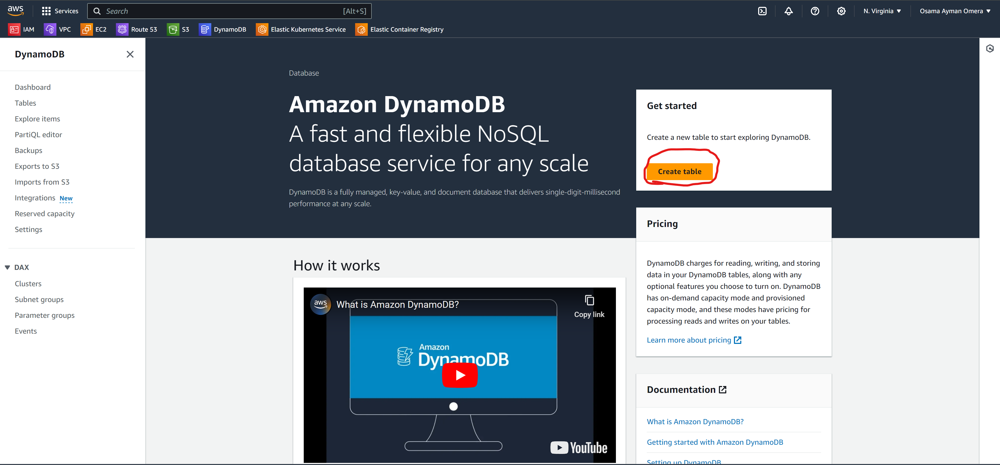
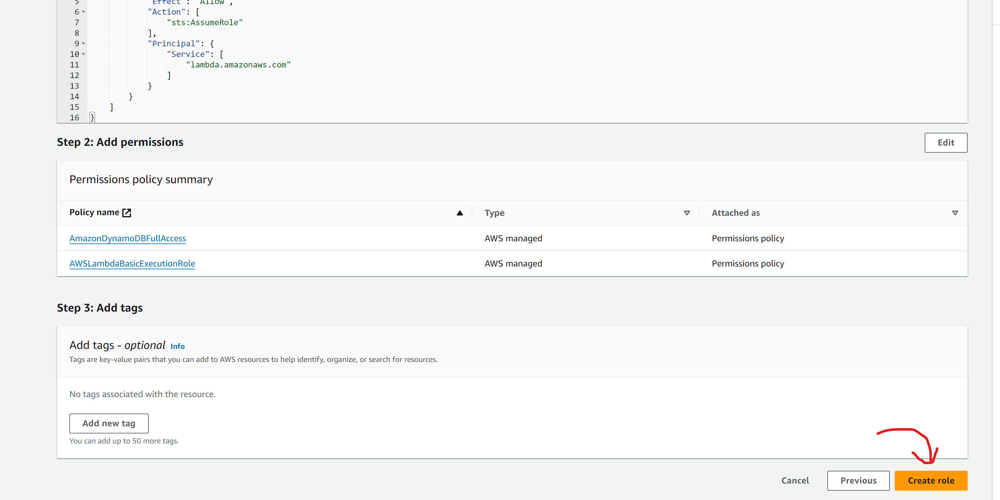

# Lab 23: Serverless Application Development

## Objective
Build a serverless application using AWS Lambda, API Gateway, and DynamoDB.

## Prerequisites
- AWS account with necessary permissions.
- Basic knowledge of AWS Lambda, API Gateway, and DynamoDB.

## Steps

## Step 1: Create a DynamoDB Table
1. Open the AWS Management Console.
2. Navigate to the **DynamoDB** service.
3. Click **Create table**.
4. Enter the following details:
    - **Table name**: `serverless-db`
    - **Primary key**: `id` (String)
5. Click **Create**.

    ### Screenshot:
    

    

    

    

-----------------------------------------------------------------

## Step 2: Create an IAM Role for Lambda
1. Navigate to the **IAM** service in the AWS Management Console.
2. Click **Roles** on the sidebar, then **Create role**.
3. Select **AWS service** as the trusted entity type, then choose **Lambda**.
4. Click **Next: Permissions**.
5. Attach the following policies:
    - **AmazonDynamoDBFullAccess**
    - **AWSLambdaBasicExecutionRole**
6. Click **Next: Tags**, then **Next: Review**.
7. Enter a **Role name**: `lambda-dynamodb-role`.
8. Click **Create role**.

    ### Screenshot:
    

    

    

    

    

    

    

-----------------------------------------------------------------------

## Step 3: Create a Lambda Function
1. Navigate to the **Lambda** service.
2. Click **Create function**.
3. Select **Author from scratch**.
4. Enter the following details:
    - **Function name**: `serverless-ivolve-function`
    - **Runtime**: `Node.js 14.x` (or your preferred runtime)
    - **Role**: Choose an existing role
    - **Existing role**: `lambda-dynamodb-role`
5. Click **Create function**.

    ### Screenshot:
    

    

    

-------------------------------------------------------------------------    

## Step 4: Add Code to Lambda Function
1. Scroll down to the **Function code** section.
2. Replace the default code with the following:

    ```javascript
    const AWS = require('aws-sdk');
    const dynamo = new AWS.DynamoDB.DocumentClient();
    const tableName = 'serverless-app-table';

    exports.handler = async (event) => {
        const method = event.httpMethod;
        let response;

        if (method === 'PUT') {
            const requestBody = JSON.parse(event.body);
            const item = requestBody.item;

            const params = {
                TableName: tableName,
                Item: {
                    id: Math.random().toString(36).substring(2, 15),
                    item: item
                }
            };

            try {
                await dynamo.put(params).promise();
                response = {
                    statusCode: 200,
                    body: JSON.stringify({ message: 'Item added successfully' })
                };
            } catch (error) {
                response = {
                    statusCode: 500,
                    body: JSON.stringify({ error: 'Could not add item' })
                };
            }
        } else if (method === 'GET') {
            const params = {
                TableName: tableName
            };

            try {
                const data = await dynamo.scan(params).promise();
                response = {
                    statusCode: 200,
                    body: JSON.stringify(data.Items)
                };
            } catch (error) {
                response = {
                    statusCode: 500,
                    body: JSON.stringify({ error: 'Could not retrieve items' })
                };
            }
        } else {
            response = {
                statusCode: 400,
                body: JSON.stringify({ error: 'Unsupported method' })
            };
        }

        return response;
    };
    ```

3. Click **Deploy**.

    ### Screenshot:
    
    
---------------------------------------------------------------------------

## Step 5: Create an API Gateway
1. Navigate to the **API Gateway** service.
2. Click **Create API**.
3. Choose **HTTP API**.
4. Click **Build**.
5. Enter the following details:
    - **API name**: `serverless-ivolve-api`
6. Click **Next** until you reach the **Configure routes** section.
7. Click **Add integration** and select **Lambda**.
8. Choose the **serverless-app-function** Lambda function.
9. Click **Next**, then **Create**.

    ### Screenshot:
    

    

---------------------------------------------------------------------------

## Step 6: Develop Front-End

Create an `index.html` file while in the repo on your local machine:

- `index.html` : **This is your front-end web page.**
- **PUT request**: Used to add new to-do items to DynamoDB.
- **GET request**: Used to retrieve all to-do items from DynamoDB.

----------------------------------------------------------------------

## Step 7: How to Use the Front-End

1. Replace **{invoke-url}**: Replace **{invoke-url}** in the apiUrl variable with the actual Invoke URL from your API Gateway.

2. Open the HTML file:
    - Open the `index.html` file in a web browser.
    - Use the input field to add new to-do items.
    - The list will automatically update to show the items retrieved from the DynamoDB table.

     ### Screenshot:
    

    

    

------------------------------------------------------------------------------

## Summary
In this lab, you learned how to build a serverless application using AWS Lambda, API Gateway, and DynamoDB. You created a DynamoDB table, configured IAM roles, wrote a Lambda function, set up an API Gateway, and tested your serverless application.

---------------------------------------------------
