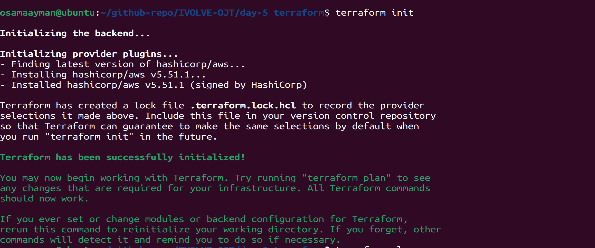
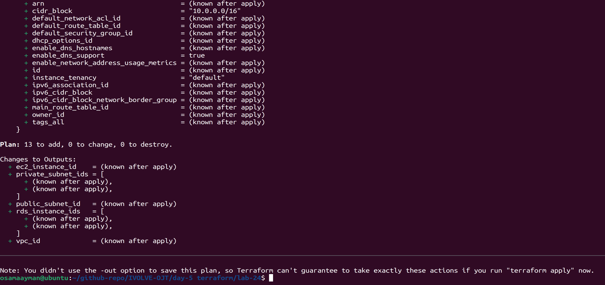
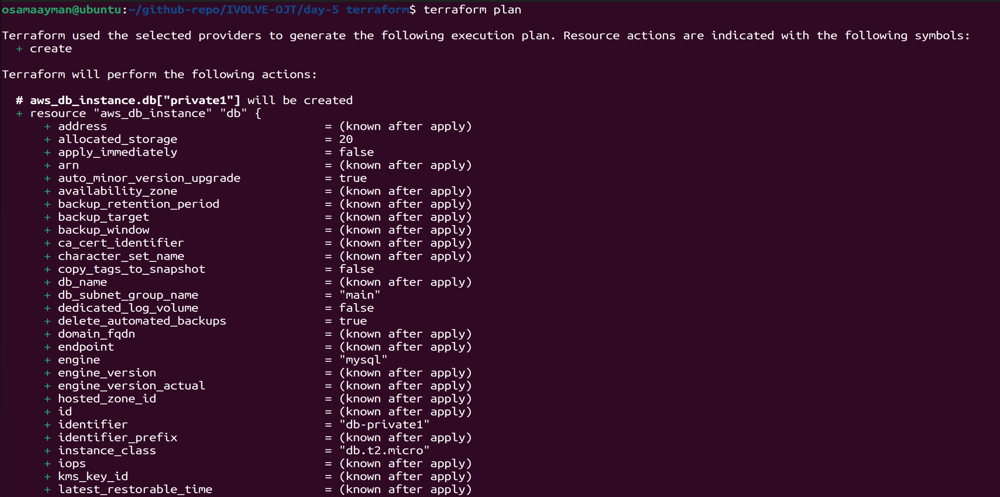
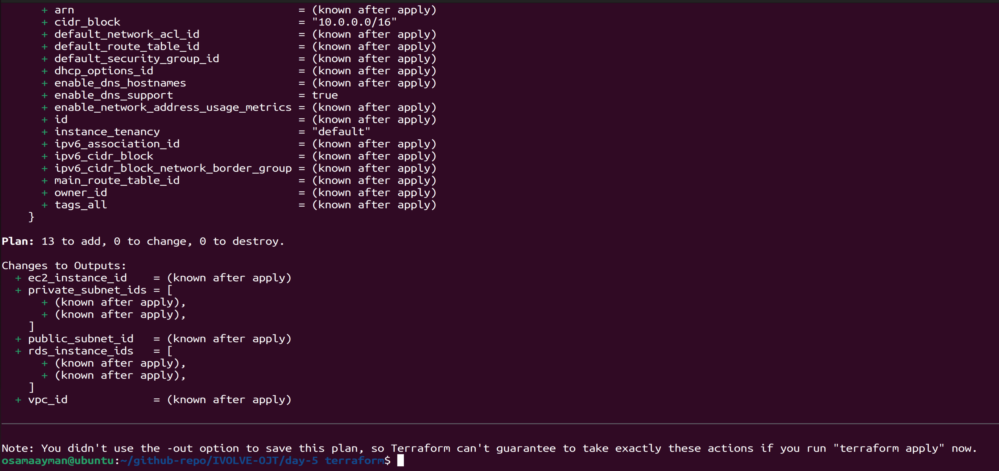
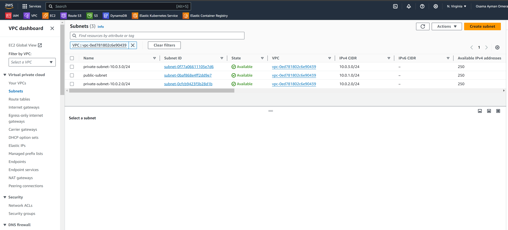
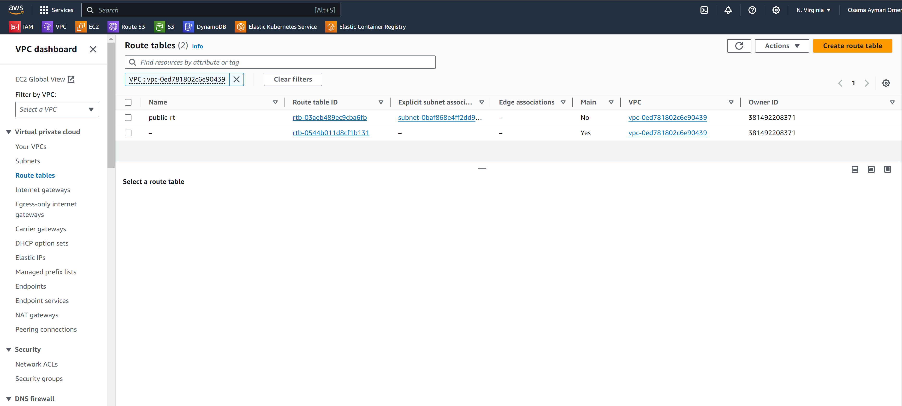
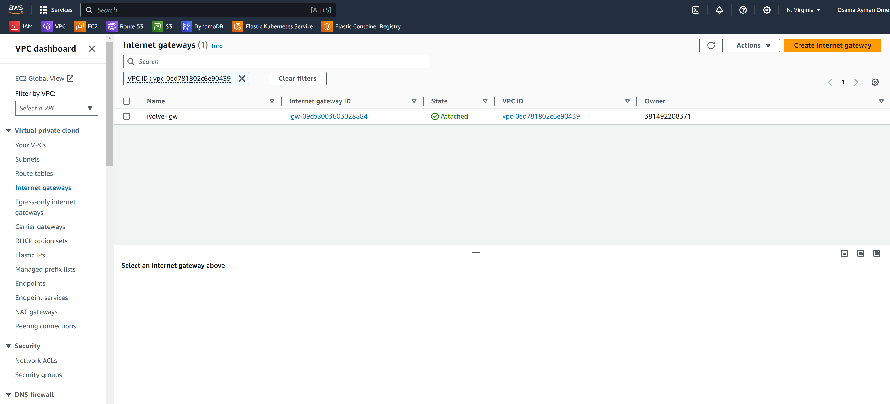

# Multi-Tier Application Deployment with Terraform

This project uses Terraform to define and deploy a multi-tier architecture on AWS, including a VPC, subnets, an EC2 instance, and an RDS database. The architecture includes one public subnet for the EC2 instance and two private subnets for the RDS database.

## Architecture Overview


## The architecture deployed in this lab includes:
- A VPC with a public and private subnet in each of two availability zones.
- An Internet Gateway attached to the VPC.
- A public route table associated with the public subnets.
- Security groups for EC2 instances and RDS instances.
- An EC2 instance in the public subnet.
- Two RDS MySQL database instances in the private subnets, each in a different availability zone.

## Prerequisites

- [Terraform](https://www.terraform.io/downloads.html) installed
- AWS account
- AWS credentials configured (either through environment variables, AWS CLI, or IAM role)

## Architecture

- **VPC**: A virtual private cloud to house the entire infrastructure.
- **Subnets**: One public subnet for the EC2 instance and two private subnets for the RDS database.
- **EC2 Instance**: A web server running in the public subnet.
- **RDS Database**: Two MySQL databases running in the private subnets.

## Project Structure

- `variables.tf`: Defines all the variables used in the project.
- `provider.tf`: Configures the AWS provider.
- `vpc.tf`: Creates the VPC and subnets.
- `ec2.tf`: Creates the EC2 instance.
- `rds.tf`: Creates the RDS instances and subnet group.
- `outputs.tf`: Defines the outputs for the infrastructure.

## Usage

1. **Clone the repository**:
   ```sh
   git clone https://github.com/Osamaomera/IVOLVE-OJT.git
   cd day-5 terraform
   cd lab-24

2. **Initialize Terraform**:
    ```sh
   terraform init
    ```
    

3. Review and adjust variables in `variables.tf` according to your requirements.

   ```bash
   terraform plan 
   ```
   

   

   

4. Apply the Terraform configuration:

   ```bash
   terraform apply --auto-approve
   ```
## Customization

Feel free to customize the configuration files as per your project requirements. You can modify subnet CIDRs, AZs, instance types, database credentials, etc., in the variables and configuration files.

## Screenshots

   

   

   

   

## Cleanup

After testing or when done with the resources, you can destroy them using Terraform:

```bash
terraform destroy --auto-approve
```