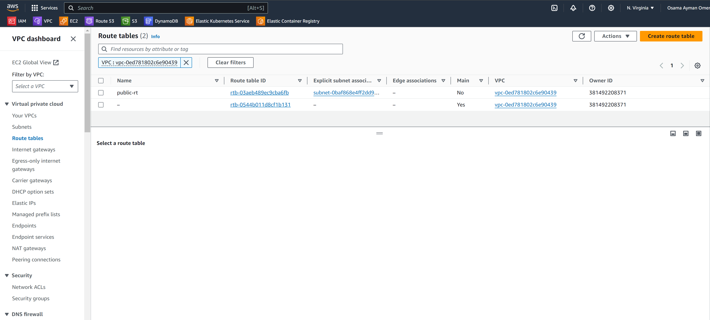

# Terraform Multi-Tier Application Deployment

This Terraform project automates the deployment of a multi-tier architecture on AWS. The architecture includes a Virtual Private Cloud (VPC), public and private subnets, EC2 instances, and RDS databases.

## Architecture Overview


## Project Structure

The project structure is organized into modules for better management and reusability:

- `modules/vpc`: Defines the VPC, subnets, and associated resources.
- `modules/ec2`: Deploys the EC2 instance in the public subnet.
- `modules/rds`: Creates RDS instances in the private subnets.
```
.
├── main.tf
├── variables.tf
├── outputs.tf
├── modules
│   ├── vpc
│   │   ├── main.tf
│   │   ├── variables.tf
│   │   ├── outputs.tf
│   ├── ec2
│   │   ├── main.tf
│   │   ├── variables.tf
│   │   ├── outputs.tf
│   ├── rds
│       ├── main.tf
│       ├── variables.tf
│       ├── outputs.tf
```

## Prerequisites

Before running Terraform, make sure you have:

1. AWS CLI configured with appropriate credentials.
2. Terraform installed on your machine.

## Usage

1. Clone the repository:

   ```bash
   git clone https://github.com/Osamaomera/IVOLVE-OJT.git
   cd day-5 terraform
   cd lab-25
   ```

2. Initialize Terraform:

   ```bash
   terraform init
   ```
   

3. Review and adjust variables in `variables.tf` according to your requirements.
   

   
4. Apply the Terraform configuration:

   ```bash
   terraform apply --auto-approve
   ```
   

      

   

## Configuration Files

### `variables.tf`

- Defines input variables for the project, including VPC CIDR, subnet CIDRs, AZs, AMI IDs, instance types, database credentials, etc.
- Specifies values for the variables by default

### `main.tf`

- Orchestrates the deployment by calling modules for VPC, EC2, and RDS resources.

### `outputs.tf`

- Defines outputs to display after Terraform applies the configuration, such as VPC ID, subnet IDs, EC2 instance ID, and RDS instance IDs.

## Customization

Feel free to customize the configuration files as per your project requirements. You can modify subnet CIDRs, AZs, instance types, database credentials, etc., in the variables and configuration files.

## Screenshots

   

   

   

   
## Cleanup

After testing or when done with the resources, you can destroy them using Terraform:

```bash
terraform destroy --auto-approve
```


