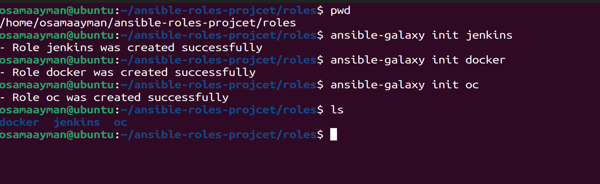
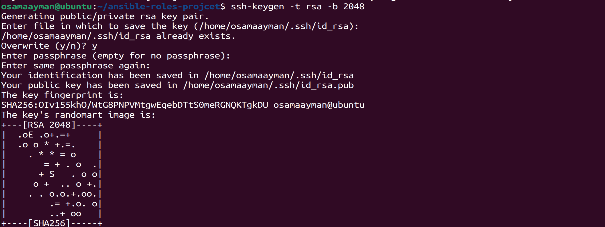
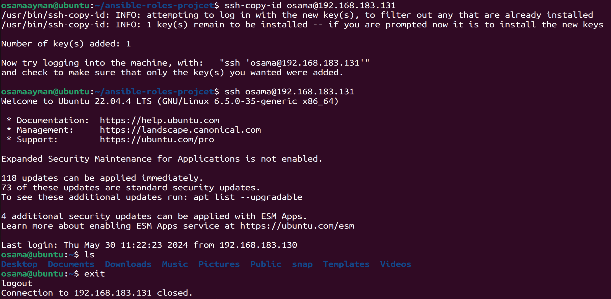
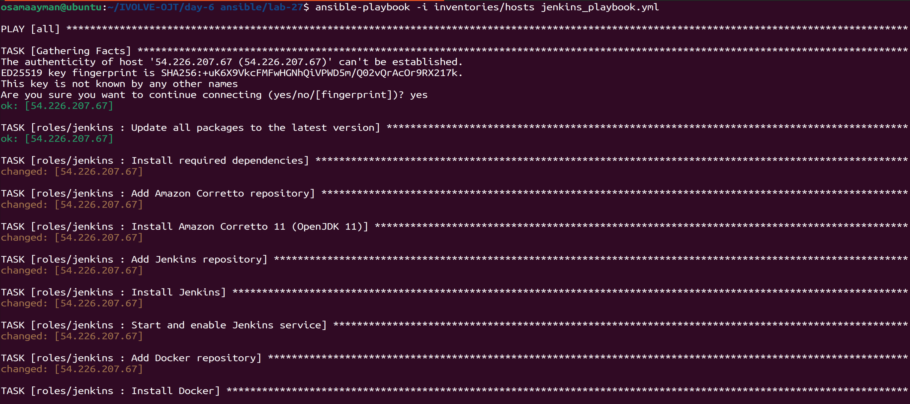
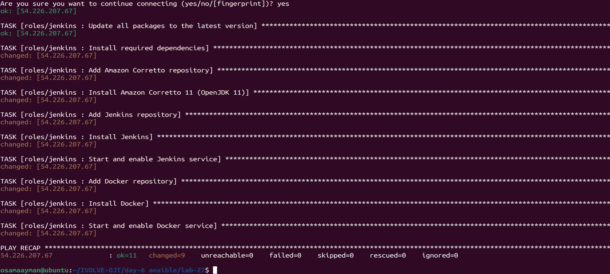
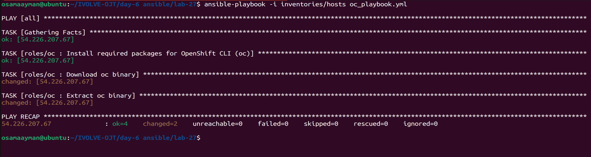
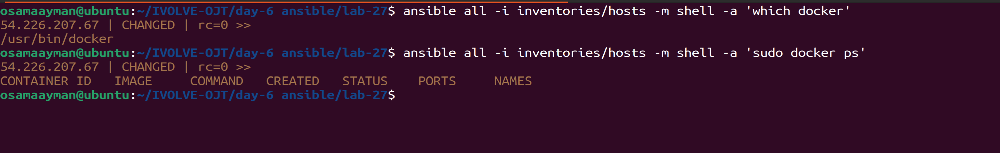
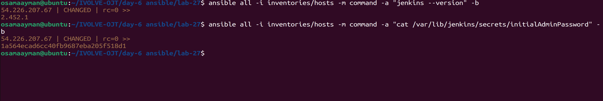
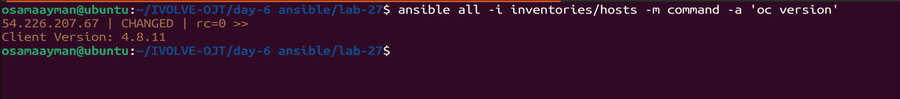

# Ansible Lab 27

This project demonstrates the use of Ansible to automate the installation of Docker, Jenkins, and the OpenShift CLI (oc) on target hosts.

## Inventory

The inventory file `inventories/hosts` contains the following:

```ini
[all]
54.226.207.67 ansible_user=ec2-user ansible_ssh_private_key_file=/home/osamaayman/ec2-ivolve.pem
```

## Roles




### Docker Role

This Ansible role installs Docker on the target hosts and adds a specified user to the Docker group.

#### Requirements

- Ansible 2.9+
- Supported platforms: Ubuntu

#### Role Variables

- `docker_user`: The username to add to the Docker group. This variable must be defined in your playbook or inventory.

#### Example Playbook

```yaml
- hosts: all
  become: yes
  vars:
    docker_user: "your_username"
  roles:
    - docker
```

### Jenkins Role

This Ansible role installs Jenkins on the target hosts.

#### Requirements

- Ansible 2.9+
- Supported platforms: Ubuntu

#### Example Playbook

```yaml
- hosts: all
  become: yes
  roles:
    - roles/jenkins
```

### OpenShift CLI (oc) Role

This Ansible role installs the OpenShift CLI (oc) on the target hosts.

#### Requirements

- Ansible 2.9+
- Supported platforms: Ubuntu

#### Role Variables

- `oc_version`: The version of the OpenShift CLI to install. This variable must be defined in your playbook or inventory.

#### Example Playbook

```yaml
- hosts: all
  become: yes
  vars:
    oc_version: "4.10.1"
  roles:
    - roles/oc
```

## Playbooks

### Playbook for Docker and Jenkins

This playbook runs the Docker and Jenkins roles.

```yaml
---
- hosts: all
  become: yes
  vars:
    docker_user: "your_username"
  roles:
    - roles/docker
    - roles/jenkins
```

### Playbook for OpenShift CLI (oc)

This playbook runs the oc role.

```yaml
---
- hosts: all
  become: yes
  vars:
    oc_version: "4.10.1"
  roles:
    - roles/oc
```

## Usage

To run the playbooks, use the following commands:

1. **Run Docker and Jenkins Playbook:**

   ```bash
   ansible-playbook -i inventory docker_jenkins_playbook.yml
   ```

2. **Run OpenShift CLI (oc) Playbook:**

   ```bash
   ansible-playbook -i inventory oc_playbook.yml
   ```

Replace `inventory` with the path to your actual Ansible inventory file. Adjust the variable values (`docker_user` and `oc_version`) as needed.

## Project Structure

```
.
├── ansible.cfg
├── inventories
│   └── hosts
├── jenkins_docker_playbook.yml
├── oc_playbook.yml
├── README.md
└── roles
    ├── docker
    │   ├── README.md
    │   └── tasks
    │       └── main.yml
    ├── jenkins
    │   ├── README.md
    │   └── tasks
    │       └── main.yml
    └── oc
        ├── README.md
        └── tasks
            └── main.yml

```

## Screenshots.
## Key created 
  
  

  

## Run Playbooks
### jenkins and docker 

  

  

### OC 

  

## Ensure the installing by run adhook commands





