# Lab 20: Launching an EC2 Instance

## Objective
Create a private subnet, launch an EC2 instance, configure security groups, and connect to the instance using a bastion host.

## Prerequisites
- AWS Account
- Basic understanding of AWS services

## Steps

## Step 1: Create a VPC

1. Open the **AWS Management Console**.
2. Navigate to the **VPC** service.
3. Click **Create VPC**.
4. Enter the following details:
    - **Name tag**: `lab-20`
    - **IPv4 CIDR block**: `10.0.0.0/16`
    - **Tenancy**: Default
5. Click **Create VPC**.

    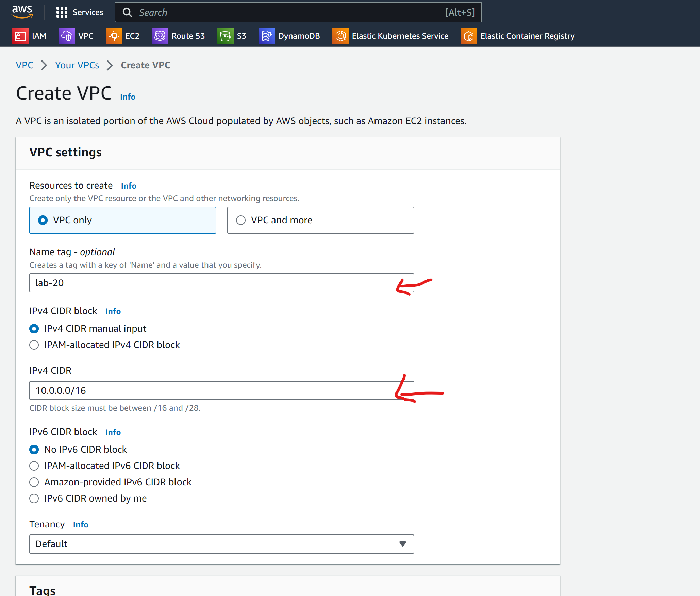

    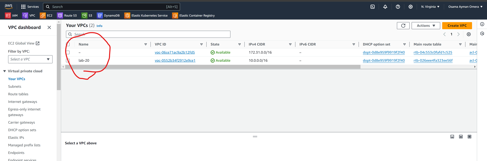


## Step 2: Create Subnets

#### Create a Public Subnet

1. In the VPC Dashboard, click **Subnets** > **Create subnet**.
2. Enter the following details:
    - **Name tag**: `publicsubnet-lab20`
    - **VPC**: `lab-20`
    - **IPv4 CIDR block**: `10.0.1.0/24`
3. Click **Create subnet**.

    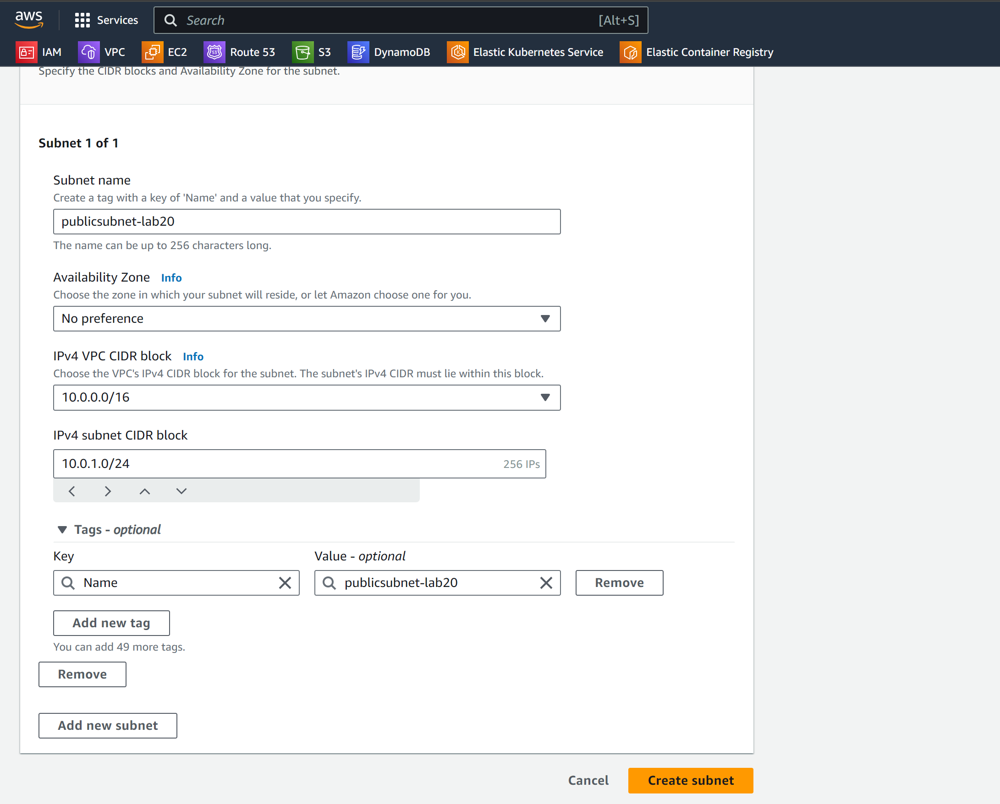

#### Create a Private Subnet

1. Click **Create subnet**.
2. Enter the following details:
    - **Name tag**: `privatesubnet-lab20`
    - **VPC**: `lab-20`
    - **IPv4 CIDR block**: `10.0.2.0/24`
3. Click **Create subnet**.

    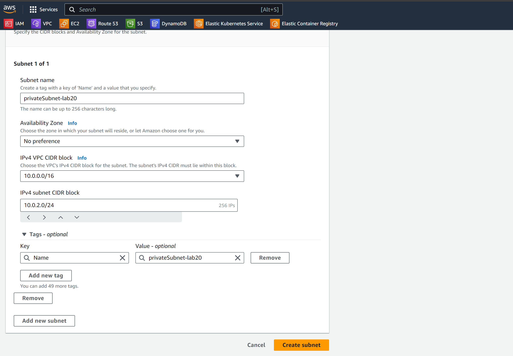

## Step 3: Create an Internet Gateway

1. In the VPC Dashboard, click **Internet Gateways** > **Create internet gateway**.
2. Enter the following details:
    - **Name tag**: `lab20-igw`
3. Click **Create internet gateway**.
4. Select the newly created Internet Gateway and click **Attach to VPC**.
5. Select `lab-20` and click **Attach internet gateway**.

    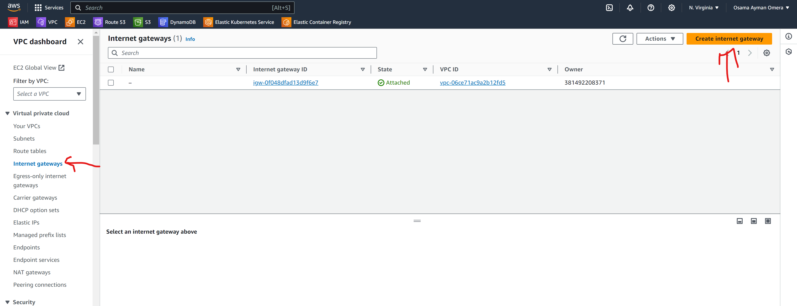

    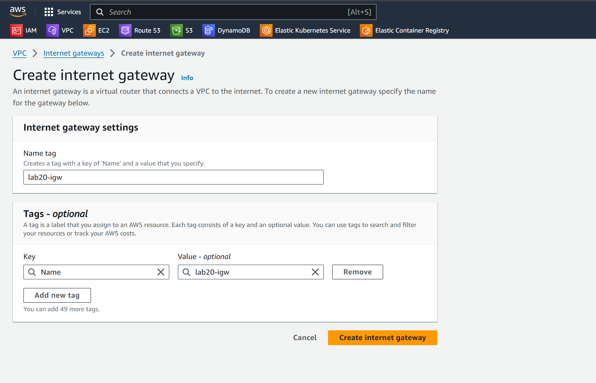

    

    

## Step 4: Create Route Tables

### Create a Route Table for the Public Subnet

1. In the VPC Dashboard, click **Route Tables** > **Create route table**.
2. Enter the following details:
    - **Name tag**: `public-rt`
    - **VPC**: `lab-20`
3. Click **Create route table**.
4. Select the newly created Route Table and click **Edit routes**.
5. Add the following route:
    - **Destination**: `0.0.0.0/0`
    - **Target**: `lab20-igw`
6. Click **Save routes**.
7. Select the Route Table and click **Edit subnet associations**.
8. Associate the **PublicSubnet** with this Route Table.

    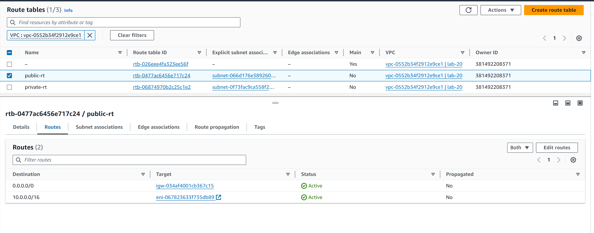

    

### Create a Route Table for the Private Subnet

1. In the VPC Dashboard, click **Route Tables** > **Create route table**.
2. Enter the following details:
    - **Name tag**: `private-rt`
    - **VPC**: `lab-20`
3. Click **Create route table**.
4. Select the Route Table and click **Edit subnet associations**.
5. Associate the **PrivateSubnet** with this Route Table.

    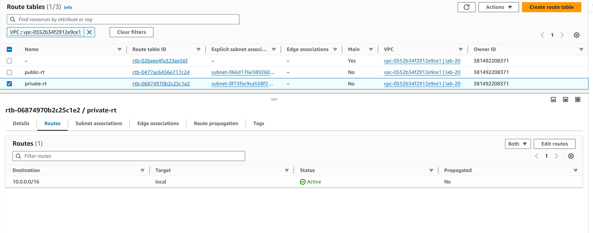

    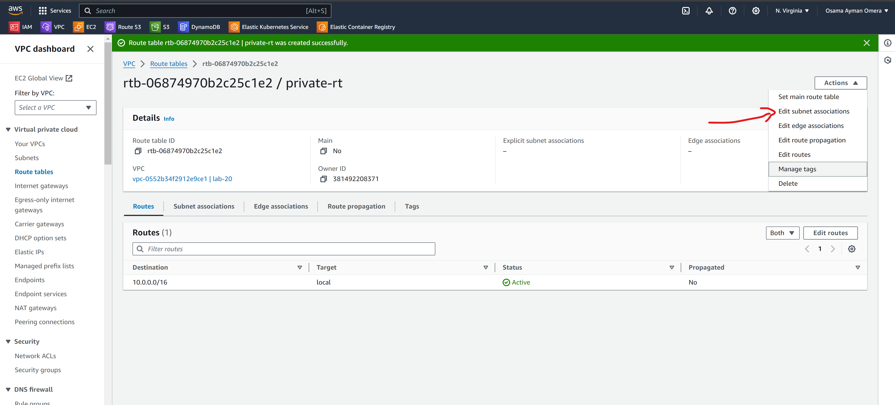

    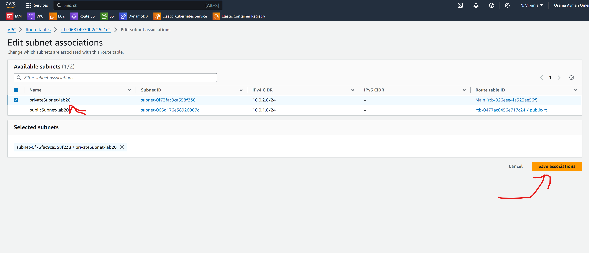

## Step 5: Launch an EC2 Instance in the Public Subnet (Bastion Host)

1. Navigate to the **EC2 Dashboard**.
2. Click **Launch Instance**.
3. Enter the following details:
    - **Name**: `public-ec2`
    - **AMI**: Amazon Linux 2
    - **Instance type**: `t2.micro`
    - **Key pair**: Choose an existing key pair or create a new one
    - **Network settings**:
        - **VPC**: `lab-20`
        - **Subnet**: `publicsubnet-lab20`
        - **Auto-assign Public IP**: Enable
    - **Configure security group**:
        - **Create a new security group**:
            - **Security group name**: `publicsg`
            - **Description**: Security group for Bastion Host
            - **Inbound rules**:
                - **Type**: SSH
                - **Source**: Your IP
4. Click **Launch instance**.

    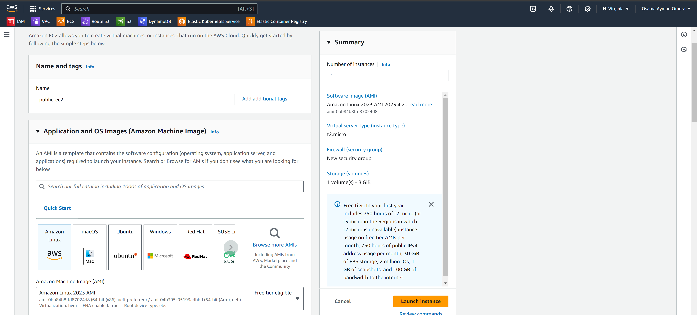

    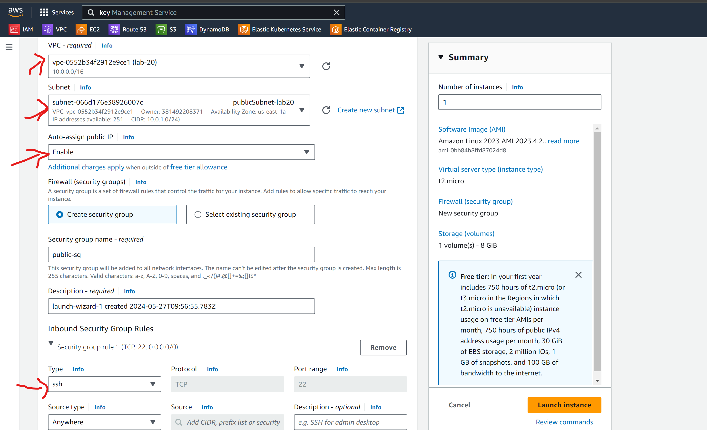


## Step 6: Launch an EC2 Instance in the Private Subnet

1. Navigate to the **EC2 Dashboard**.
2. Click **Launch Instance**.
3. Enter the following details:
    - **Name**: `private-ec2`
    - **AMI**: Amazon Linux 2
    - **Instance type**: `t2.micro`
    - **Key pair**: Choose the same key pair used for Bastion Host
    - **Network settings**:
        - **VPC**: `lab-20`
        - **Subnet**: `privatesubnet-lab20`
        - **Auto-assign Public IP**: Disable
    - **Configure security group**:
        - **Create a new security group**:
            - **Security group name**: `privatesg`
            - **Description**: Security group for Private Instance
            - **Inbound rules**:
                - **Type**: SSH
                - **Source**: `publicsg`
4. Click **Launch instance**.


## Step 7: Connect to the Bastion Host

1. Open your terminal.
2. Connect to the Bastion Host using SSH ip **54.81.45.50**:
    ```sh
    ssh -i ec2-ivolve.pem ec2-user@54.81.45.50
    ```
    
    

### Step 8: Connect to the Private Instance via Bastion Host

1. First I use the same key pair so i copy it from local machine to public-ec2
    ```sh
    scp -i "ec2-ivolve.pem" ec2-ivolve.pem ec2-user@<PrivateInstancePrivateIP>:/home/ec2-user
    ```
    
2. From the Bastion Host, connect to the Private Instance using SSH:
    ```sh
    ssh -i /path/to/your-key-pair.pem ec2-user@<PrivateInstancePrivateIP>
    ```

    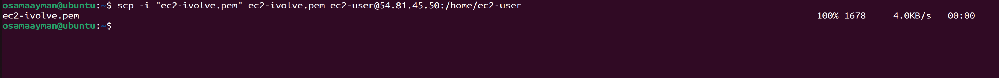

    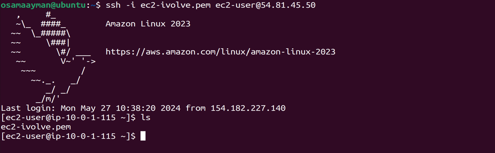

## Conclusion
You have successfully created a VPC with public and private subnets, launched EC2 instances, configured security groups, and connected to a private instance using a bastion host.

## Troubleshooting
- Ensure that your key pair is correctly specified.
- Make sure your security group rules are correctly configured.
- Verify that your instances are running and reachable.

